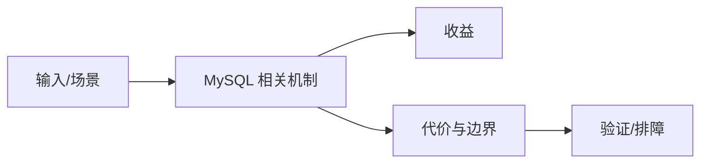

# 连接池与 Event Scheduler 边界

## 来源
- [FastAPI 不用 SQLModel，如何用 DBUtils 直连 MySQL 数据库](<../文章/done-FastAPI 不用 SQLModel，如何用 DBUtils 直连 MySQL 数据库.md>)
- [MySQL定时任务，解放双手，轻松实现自动化](<../文章/done-MySQL定时任务，解放双手，轻松实现自动化.md>)

## 核心问题
MySQL 接入层要区分应用连接池和数据库内置调度。DBUtils 解决 Python/FastAPI 同步连接复用问题；Event Scheduler 适合低频、简单、库内数据维护，不适合替代 Airflow/DolphinScheduler 这类外部工作流调度。

## 判断准则
- 连接池要限制最大连接、超时、重试和泄漏检测，避免把数据库连接当无限资源。
- Event Scheduler 只用于数据库内部简单任务；跨系统依赖、补数和审计要用外部调度。

## 认知偏差
| 常见错误认知 | 正确理解 |
|---|---|
| 只要文章给了性能数字或最佳实践，就可以直接复用 | 必须确认版本、数据规模、查询/写入模式、硬件和失败场景 |
| 只按标题中的技术名归类 | 以正文主问题和技术本体归类 |
| 能跑通示例就等于生产可用 | 还要验证权限、恢复、监控、重试、成本和边界条件 |
| “解放双手”式定时任务文章容易忽略权限、失败告警、重试和审计。 | 把它记录为降权或待验证点，而不是稳定结论 |

## 架构/流程图（如有）

## 待验证缺口
- 需要补 MySQL Event Scheduler 官方限制和连接池压测。
