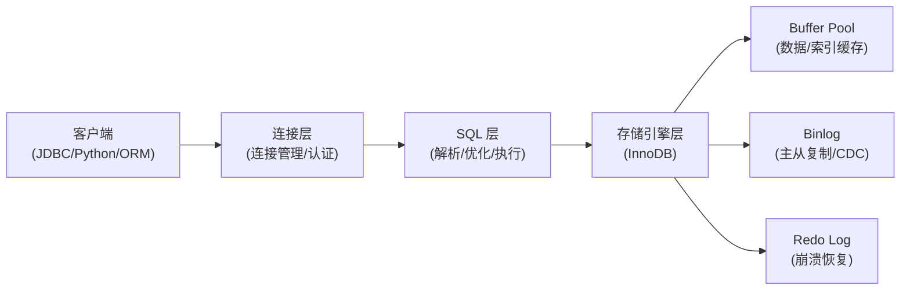

# MySQL

## 技术定位

| 项 | 内容 |
|---|---|
| 技术名 | MySQL |
| 一级类目 | OLAP 与数据库 |
| 二级类目 | 关系数据库 |
| 技术本体 | 开源关系型数据库，主要解决 Web 应用 OLTP 场景的事务、点查、常规写入问题 |
| 全局架构位置 | 数据库层，承担应用数据持久化、事务保障、常规关系查询；也是数据工程同步链路常见的数据源（CDC）|
| 主要使用者 | 后端工程师、数据工程师（作为上游数据源）|
| 主要产出 | 数据库实例、表/索引/存储过程/定时任务、binlog、主从复制 |

## 官方锚点

- 官网：https://www.mysql.com/
- 官方文档：https://dev.mysql.com/doc/
- GitHub（MySQL Server）：https://github.com/mysql/mysql-server

## 架构图

> 基于本地文章描述整理，精修时补充官方架构图。

## 核心模块

| 模块 | 职责 | 重点问题 |
|---|---|---|
| InnoDB 存储引擎 | 事务、MVCC、行锁、Buffer Pool、Redo/Undo Log | MVCC 版本链如何维护，事务隔离级别影响 |
| 查询优化器 | 执行计划生成、索引选择、统计信息 | 为什么执行计划走全表扫描，如何强制索引 |
| 定时任务（Event Scheduler）| 数据库内置定时任务，替代部分 cron | 使用场景和限制，与外部调度对比 |
| 常用函数 | 字符串、数学、日期、聚合、窗口函数 | 百分等级（PERCENT_RANK）、分组内排名 |
| 主从复制 / Binlog | 数据同步、CDC 数据源 | Binlog 格式、CDC 消费链路（Flink CDC、Canal）|
| 连接池管理 | DBUtils 等连接池，控制并发和连接数 | 连接泄漏、连接超时、异步与同步边界 |

## 上下游

| 方向 | 对象 | 关系 |
|---|---|---|
| 上游 | 应用服务 / FastAPI | OLTP 写入和查询 |
| 下游 | 应用 / 报表 / BI | 查询结果消费 |
| 下游 | Flink CDC / Canal / SeaTunnel | Binlog 作为 CDC 数据源 |
| 下游 | 分析工具（DeepAgents / LLM 工具）| MySQL 作为分析查询目标 |
| 依赖 | 操作系统文件系统 / InnoDB 存储格式 | 数据文件和 Redo Log 持久化 |

## 横向对标

| 对标技术 | 对标点 | 优势 | 劣势 | 使用判断 |
|---|---|---|---|---|
| PostgreSQL | OLTP 关系数据库 | MySQL 生态更成熟（尤其 Web），运维更简单 | 扩展性和 SQL 标准完整度弱于 PG | 简单 Web OLTP 可选 MySQL；复杂查询或扩展插件选 PG |
| TiDB | 分布式 HTAP | MySQL 单机运维成本低，兼容性更高 | 不支持水平扩展，读写瓶颈明显 | 数据量可单机承载且不需要 HTAP 时选 MySQL |
| SQLite | 嵌入式 RDBMS | MySQL 支持网络服务化、并发写入 | SQLite 更轻量，适合嵌入式和本地工具 | 服务化、多用户并发选 MySQL |

## 已沉淀核心知识点

| 主题 | 文件 | 问题指纹 | 解决什么问题 | 认知增量 |
|---|---|---|---|---|
| （待填入，精读候选处理后更新） | - | - | - | - |

## 本地文章索引

| 文章 | 技术对象 | 阅读投入建议 | 状态 |
|---|---|---|---|
| [FastAPI 不用 SQLModel，如何用 DBUtils 直连 MySQL 数据库](<文章/FastAPI 不用 SQLModel，如何用 DBUtils 直连 MySQL 数据库.md>) | 连接池 / FastAPI 集成 | 精读 | 精读候选 |
| [MySQL定时任务，解放双手，轻松实现自动化](文章/MySQL定时任务，解放双手，轻松实现自动化.md) | Event Scheduler | 精读 | 精读候选 |
| [MySQL常用函数](文章/MySQL常用函数.md) | 内置函数 | 略读 | 待处理 |
| [MySQL数据分析：计算一个值在其分组中的百分等级](文章/MySQL数据分析：计算一个值在其分组中的百分等级.md) | 窗口函数 / 分析函数 | 精读 | 待处理 |
| [MySQL的MVCC是什么？为什么需要MVCC？](文章/MySQL的MVCC是什么？为什么需要MVCC？.md) | InnoDB MVCC | 精读 | 精读候选 |
| [企业级 MySQL 数据分析助手落地方案：基于 DeepAgents 的全流程实践](<文章/企业级 MySQL 数据分析助手落地方案：基于 DeepAgents 的全流程实践.md>) | MySQL + AI 分析 | 略读 | 待处理 |
| [性能比拼: MySQL vs PostgreSQL](<../040202_PostgreSQL/文章/性能比拼_ MySQL vs PostgreSQL.md>) | 对标 PostgreSQL | 精读 | 精读候选（与 PG 共享）|
| [一次 SQL 查询优化原理分析：900W+ 数据，从 17s 到 300ms](<文章/一次 SQL 查询优化原理分析：900W+ 数据，从 17s 到 300ms.md>) | InnoDB 分页优化 / 延迟关联 | 精读 | 从通用查询优化目录纠偏迁入 |

## 后续追查

- 关键词：InnoDB、MVCC、Binlog、连接池、Event Scheduler、慢查询、执行计划
- 待读资料：官方 InnoDB 存储引擎文档、Binlog 格式文档
- 待补实验：DBUtils 连接池最小复现；MVCC 读视图行为验证
