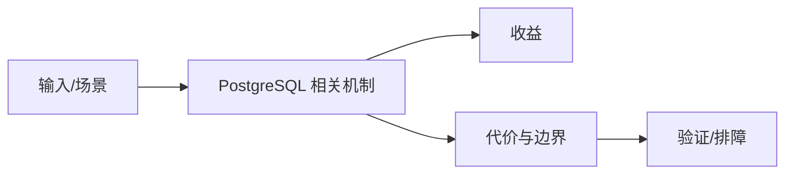

# TOAST 与 LISTEN/NOTIFY 边界

## 来源
- [简单解析下PostgreSQL的Toast](<../文章/done-简单解析下PostgreSQL的Toast.md>)
- [Postgres - 基于Listen_Notify构建轻量级发布订阅系统](<../文章/done-Postgres - 基于Listen_Notify构建轻量级发布订阅系统.md>)

## 核心问题
TOAST 和 LISTEN/NOTIFY 都是 PostgreSQL 的能力边界提醒：TOAST 让大字段可存但会带来外存、压缩、读取放大和 Vacuum 成本；LISTEN/NOTIFY 能做轻量通知但不是高吞吐消息队列。

## 判断准则
- 大字段频繁读取时要评估 TOAST 外存和行膨胀，不要只看表结构能否存。
- LISTEN/NOTIFY 适合低频事件通知，不适合可靠队列、持久回放和消费组治理。

## 认知偏差
| 常见错误认知 | 正确理解 |
|---|---|
| 只要文章给了性能数字或最佳实践，就可以直接复用 | 必须确认版本、数据规模、查询/写入模式、硬件和失败场景 |
| 只按标题中的技术名归类 | 以正文主问题和技术本体归类 |
| 能跑通示例就等于生产可用 | 还要验证权限、恢复、监控、重试、成本和边界条件 |
| “数据库自带能力”不等于可以替代专用对象存储或消息系统。 | 把它记录为降权或待验证点，而不是稳定结论 |

## 架构/流程图（如有）

## 待验证缺口
- 需要补消息大小、事务提交后通知、连接中断丢消息等官方限制。
