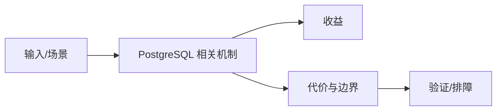

# pgvector 与多模态检索边界

## 来源
- [PgSQL + pgvector — 不止存储，更懂智能](<../文章/done-PgSQL + pgvector — 不止存储，更懂智能.md>)
- [PostgreSQL + pgvector AI 超级大脑配置指南](<../文章/done-PostgreSQL + pgvector AI 超级大脑配置指南.md>)
- [pgvector 非权威指南](<../文章/done-pgvector 非权威指南.md>)
- [体验 PostgreSQL 的 AI 扩展 pgvector](<../文章/done-体验 PostgreSQL 的 AI 扩展 pgvector.md>)
- [用PostgreSQL搞定多模态数据：文本+图片Embedding实战](<../文章/done-用PostgreSQL搞定多模态数据：文本+图片Embedding实战.md>)

## 核心问题
pgvector 让 PostgreSQL 能承载向量列、相似检索和部分多模态检索场景，适合把结构化过滤和向量召回放在同一数据库里。它的边界是索引类型、向量规模、召回质量、写入更新和专用向量库的性能对比。

## 判断准则
- 结构化过滤强、数据规模中小、团队已有 PG 运维能力时可优先评估 pgvector。
- 大规模 ANN、高吞吐更新、多租户隔离和复杂召回策略要和专用向量库对比。

## 认知偏差
| 常见错误认知 | 正确理解 |
|---|---|
| 只要文章给了性能数字或最佳实践，就可以直接复用 | 必须确认版本、数据规模、查询/写入模式、硬件和失败场景 |
| 只按标题中的技术名归类 | 以正文主问题和技术本体归类 |
| 能跑通示例就等于生产可用 | 还要验证权限、恢复、监控、重试、成本和边界条件 |
| “AI 超级大脑”是营销表达，工程判断要看召回率、延迟、索引构建成本和过滤条件。 | 把它记录为降权或待验证点，而不是稳定结论 |

## 架构/流程图（如有）

## 待验证缺口
- 需要补 HNSW/IVFFlat 参数、召回率和 EXPLAIN 验证。
