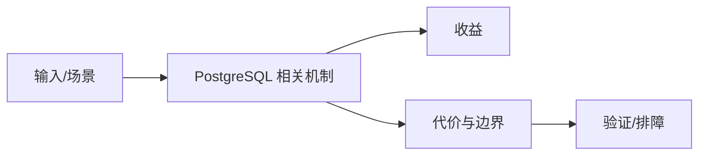

# PostgreSQL 与 MySQL 选型边界

## 来源
- [性能比拼_ MySQL vs PostgreSQL](<../文章/done-性能比拼_ MySQL vs PostgreSQL.md>)
- [我最爱的关系型开源数据库：postgres，强烈推荐！](<../文章/done-我最爱的关系型开源数据库：postgres，强烈推荐！.md>)

## 核心问题
PostgreSQL 与 MySQL 的差异不能只按性能排名判断。MySQL 更常见于 Web OLTP 生态和简单运维；PostgreSQL 强在复杂 SQL、扩展、JSON、GIS、RLS 和一致性能力。选型要从生态、扩展、团队经验、事务语义、运维和数据规模一起看。

## 判断准则
- 复杂查询、扩展插件、权限治理和 JSON/GIS 优先看 PostgreSQL。
- 简单 Web OLTP、现有 MySQL 生态和团队经验强时不必为“更强”迁移。

## 认知偏差
| 常见错误认知 | 正确理解 |
|---|---|
| 只要文章给了性能数字或最佳实践，就可以直接复用 | 必须确认版本、数据规模、查询/写入模式、硬件和失败场景 |
| 只按标题中的技术名归类 | 以正文主问题和技术本体归类 |
| 能跑通示例就等于生产可用 | 还要验证权限、恢复、监控、重试、成本和边界条件 |
| 推荐型文章容易把个人偏好写成通用结论，必须回到业务约束。 | 把它记录为降权或待验证点，而不是稳定结论 |

## 架构/流程图（如有）

## 待验证缺口
- 需要补相同工作负载下的基准与运维成本对比。
