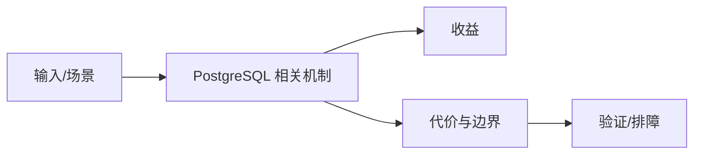

# 权限治理与 PostgREST 边界

## 来源
- [PG数据库｜PostgreSQL权限管理深度解析：从授权到合规的全链路实践](<../文章/done-PG数据库｜PostgreSQL权限管理深度解析：从授权到合规的全链路实践.md>)
- [PostgreSQL教程（7）｜用户与权限管理](<../文章/done-PostgreSQL教程（7）｜用户与权限管理.md>)
- [更轻更自由，还要什么自行车：别急上Supabase，先试试它的内核PostgREST](<../文章/done-更轻更自由，还要什么自行车：别急上Supabase，先试试它的内核PostgREST.md>)

## 核心问题
PostgreSQL 权限体系可以从角色、对象授权、Schema、默认权限、RLS 一直延伸到 PostgREST 这类 API 层。PostgREST 的价值在于把数据库约束、视图和权限暴露为 HTTP API，但这也要求数据库侧权限模型足够严谨。

## 判断准则
- 权限治理要按角色、Schema、对象、默认权限、RLS 分层，避免给超级用户或宽泛授权。
- PostgREST 适合数据库契约清晰的小型 API，不适合绕过业务服务的复杂领域逻辑。

## 认知偏差
| 常见错误认知 | 正确理解 |
|---|---|
| 只要文章给了性能数字或最佳实践，就可以直接复用 | 必须确认版本、数据规模、查询/写入模式、硬件和失败场景 |
| 只按标题中的技术名归类 | 以正文主问题和技术本体归类 |
| 能跑通示例就等于生产可用 | 还要验证权限、恢复、监控、重试、成本和边界条件 |
| 把 PostgREST 当“省后端”会低估权限、审计、业务校验和版本兼容成本。 | 把它记录为降权或待验证点，而不是稳定结论 |

## 架构/流程图（如有）

## 待验证缺口
- 需要补 RLS 和 JWT claims 的最小验证样例。
