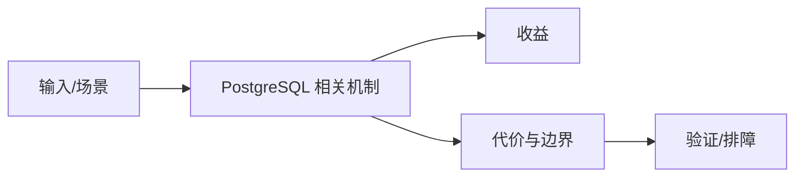

# 架构、WAL 与高可用边界

## 来源
- [5分钟看懂 PostgreSQL 工作原理](<../文章/done-5分钟看懂 PostgreSQL 工作原理.md>)
- [PostgreSQL 架构与内部机制介绍](<../文章/done-PostgreSQL 架构与内部机制介绍.md>)
- [PG数据库｜PostgreSQL WAL 文件全解析：从命名规则到归档管理，一文吃透“生命线”逻辑！](<../文章/done-PG数据库｜PostgreSQL WAL 文件全解析：从命名规则到归档管理，一文吃透“生命线”逻辑！.md>)
- [PostgreSQL 高可用学习指南](<../文章/done-PostgreSQL 高可用学习指南.md>)
- [PG数据库｜PostgreSQL上线参数调优：企业级性能优化全攻略](<../文章/done-PG数据库｜PostgreSQL上线参数调优：企业级性能优化全攻略.md>)

## 核心问题
PostgreSQL 的稳定性判断要从进程模型、共享内存、WAL、后台进程和复制链路一起看。WAL 是崩溃恢复、归档、流复制和 PITR 的生命线；高可用不是只搭主从，还要保证 WAL 连续性、复制延迟、切换和恢复演练。

## 判断准则
- 归档失败、复制槽堆积和磁盘空间是 PostgreSQL 高可用的核心风险。
- 上线参数调优必须有负载、内存、连接数和 IO 基线，不能套通用清单。

## 认知偏差
| 常见错误认知 | 正确理解 |
|---|---|
| 只要文章给了性能数字或最佳实践，就可以直接复用 | 必须确认版本、数据规模、查询/写入模式、硬件和失败场景 |
| 只按标题中的技术名归类 | 以正文主问题和技术本体归类 |
| 能跑通示例就等于生产可用 | 还要验证权限、恢复、监控、重试、成本和边界条件 |
| “5 分钟看懂架构”只能作为入口，真正运维要落到 WAL、Autovacuum、checkpoint 和复制状态。 | 把它记录为降权或待验证点，而不是稳定结论 |

## 架构/流程图（如有）

## 待验证缺口
- 需要补官方 WAL/HA 文档和 Patroni 等方案边界。
