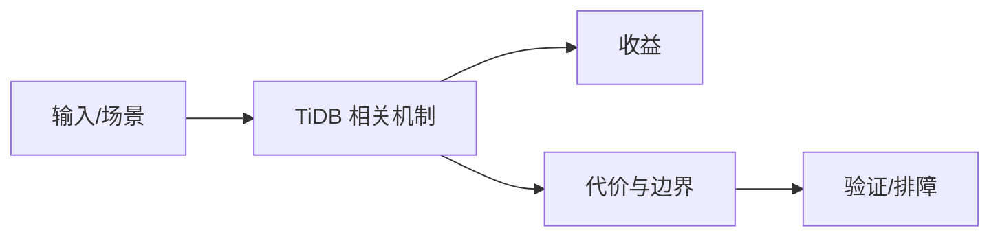

# TiDB DM 迁移复杂度边界

## 来源
- [TiDB 工具分享｜TiDB DM 简化数据迁移流程复杂度](<../文章/done-TiDB 工具分享｜TiDB DM 简化数据迁移流程复杂度.md>)

## 核心问题
TiDB DM 解决的是 MySQL/MariaDB 到 TiDB 的全量加增量迁移复杂度。它降低了迁移链路搭建成本，但迁移仍要处理表结构兼容、全量校验、增量位点、冲突、回滚和业务切换窗口。

## 判断准则
- 迁移方案要包含全量导入、增量追平、校验、灰度切流和回滚。
- DM 简化工具操作，不消除源端兼容性和业务停写窗口问题。

## 认知偏差
| 常见错误认知 | 正确理解 |
|---|---|
| 只要文章给了性能数字或最佳实践，就可以直接复用 | 必须确认版本、数据规模、查询/写入模式、硬件和失败场景 |
| 只按标题中的技术名归类 | 以正文主问题和技术本体归类 |
| 能跑通示例就等于生产可用 | 还要验证权限、恢复、监控、重试、成本和边界条件 |
| 工具分享文章容易把“能跑通”写成“迁移简单”，缺少失败处理。 | 把它记录为降权或待验证点，而不是稳定结论 |

## 架构/流程图（如有）

## 待验证缺口
- 需要补 DM 官方任务状态、错误恢复和数据校验工具。
