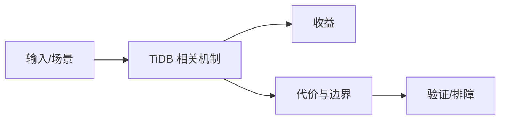

# HTAP 架构与 TiFlash 边界

## 来源
- [TiDB 7.0 发版](<../文章/done-TiDB 7.0 发版.md>)
- [TiDB 团队 11 周年的思考和判断](<../文章/done-TiDB 团队 11 周年的思考和判断.md>)

## 核心问题
TiDB 的核心价值是把兼容 MySQL 的 SQL 层、TiKV 行存事务和 TiFlash 列存分析组合成 HTAP 架构。它适合数据量、可用性或分析需求超过单机 MySQL 的场景，但会引入 PD、Region、Raft、TiFlash 同步延迟和分布式运维复杂度。

## 判断准则
- 纯 OLAP 选型不要直接拿 TiDB 对标 Doris/StarRocks；TiDB 的优势是 OLTP 和轻量分析共存。
- 版本文章只作为能力演进锚点，必须补官方 Release Notes 才能写入稳定准则。

## 认知偏差
| 常见错误认知 | 正确理解 |
|---|---|
| 只要文章给了性能数字或最佳实践，就可以直接复用 | 必须确认版本、数据规模、查询/写入模式、硬件和失败场景 |
| 只按标题中的技术名归类 | 以正文主问题和技术本体归类 |
| 能跑通示例就等于生产可用 | 还要验证权限、恢复、监控、重试、成本和边界条件 |
| “分布式 HTAP”容易掩盖 TiFlash 延迟、一致性和运维复杂度。 | 把它记录为降权或待验证点，而不是稳定结论 |

## 架构/流程图（如有）

## 待验证缺口
- 需要补官方 TiDB 7.0 版本说明、TiFlash 路由和一致性文档。
