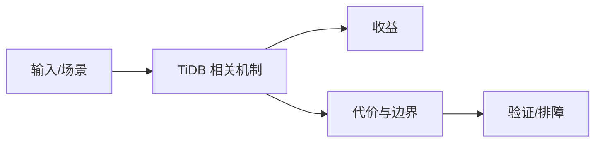

# TiDB X 新引擎待验证边界

## 来源
- [一些关于 TiDB X 的记录：新引擎](<../文章/done-一些关于 TiDB X 的记录：新引擎.md>)

## 核心问题
TiDB X 这类新引擎方向属于高不确定性技术线索，当前只适合记录“可能改变 TiDB 存储和执行边界”，不能作为生产选型依据。

## 判断准则
- 只有公开架构、源码、版本计划和可复现实验后，才能升级为稳定知识点。
- 先记录它试图解决的瓶颈，再等待官方材料确认。

## 认知偏差
| 常见错误认知 | 正确理解 |
|---|---|
| 只要文章给了性能数字或最佳实践，就可以直接复用 | 必须确认版本、数据规模、查询/写入模式、硬件和失败场景 |
| 只按标题中的技术名归类 | 以正文主问题和技术本体归类 |
| 能跑通示例就等于生产可用 | 还要验证权限、恢复、监控、重试、成本和边界条件 |
| 新引擎文章容易夹杂路线判断和社区预期，不能替代官方设计文档。 | 把它记录为降权或待验证点，而不是稳定结论 |

## 架构/流程图（如有）

## 待验证缺口
- 待补官方设计、性能基线和与 TiKV/TiFlash 的关系。
