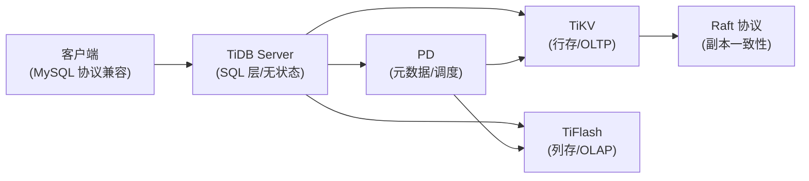

# TiDB

## 技术定位

| 项 | 内容 |
|---|---|
| 技术名 | TiDB |
| 一级类目 | OLAP 与数据库 |
| 二级类目 | 关系数据库 |
| 技术本体 | 开源分布式 HTAP 数据库，主要解决关系型数据库的水平扩展、高可用和实时 HTAP 分析问题 |
| 全局架构位置 | 分布式数据库层，同时承担 OLTP（TiKV）和 OLAP（TiFlash）；兼容 MySQL 协议 |
| 主要使用者 | 数据库工程师、平台工程、数据工程师 |
| 主要产出 | 分布式数据库集群、HTAP 查询服务、数据迁移（DM）产出链路 |

## 官方锚点

- 官网：https://www.pingcap.com/
- GitHub：https://github.com/pingcap/tidb
- 官方文档：https://docs.pingcap.com/tidb/stable
- 架构文档：https://docs.pingcap.com/tidb/stable/tidb-architecture

## 架构图

> 原图缺失（本地文章 Markdown 无架构图），基于文章描述重建。精修时补充官方架构图。

## 核心模块

| 模块 | 职责 | 重点问题 |
|---|---|---|
| TiDB Server | SQL 解析、执行计划、无状态计算层 | 兼容 MySQL 的边界，哪些 MySQL 语法不支持 |
| TiKV | 行存储引擎，OLTP 数据，基于 Raft 的分布式事务 | 分区、副本、Region 分裂和数据分布 |
| TiFlash | 列存副本，OLAP 分析，异步复制自 TiKV | 何时自动路由到 TiFlash，延迟一致性 |
| PD（Placement Driver）| 元数据管理、Region 调度、负载均衡 | PD 是单点风险，需要高可用部署 |
| TiDB DM（Data Migration）| 数据迁移工具，从 MySQL/MariaDB 迁移到 TiDB | 全量+增量迁移流程、冲突处理 |
| TiDB X（新引擎方向）| 新一代存储引擎探索（本地文章提及，细节待补）| 与 TiKV 的关系和演进路线 |

## 上下游

| 方向 | 对象 | 关系 |
|---|---|---|
| 上游 | 应用服务（MySQL 协议）| OLTP 写入和查询 |
| 上游 | TiDB DM（迁移工具）| 从 MySQL/MariaDB 迁移数据进入 TiDB |
| 下游 | BI 工具 / 报表 | 通过 TiFlash 承载 OLAP 查询 |
| 下游 | 数据工程同步链路 | TiDB 作为数仓上游数据源 |
| 依赖 | PD / Raft 协议 | 副本一致性和元数据依赖 |

## 横向对标

| 对标技术 | 对标点 | 优势 | 劣势 | 使用判断 |
|---|---|---|---|---|
| MySQL | 关系数据库 | TiDB 水平扩展、HTAP；兼容 MySQL 协议迁移成本低 | TiDB 运维复杂度更高，小数据量没有优势 | 数据量超过单机瓶颈或需要 HTAP 时考虑 TiDB |
| PostgreSQL | 关系数据库 | TiDB 分布式扩展；PG 扩展插件更丰富 | TiDB 兼容 MySQL 而非 PG，切换成本需评估 | 已有 MySQL 生态迁移分布式时 TiDB 成本更低 |
| Doris / StarRocks | OLAP 引擎 | TiDB 保留 OLTP 事务；Doris/StarRocks 纯 OLAP 性能更好 | TiDB OLAP 性能弱于专业 OLAP 引擎 | 同时需要 OLTP 和轻量 OLAP 时选 TiDB；纯分析选 Doris |
| CockroachDB | 分布式 RDBMS | TiDB 中文社区和国内生态更完善 | CockroachDB 兼容 PG 协议，全球分布更成熟 | 国内项目优先 TiDB；全球分布场景评估 CockroachDB |

## 已沉淀核心知识点

| 主题 | 文件 | 问题指纹 | 解决什么问题 | 认知增量 |
|---|---|---|---|---|
| （待填入，精读候选处理后更新） | - | - | - | - |

## 本地文章索引

| 文章 | 技术对象 | 阅读投入建议 | 图片状态 | 状态 |
|---|---|---|---|---|
| [TiDB 7.0 发版](<文章/TiDB 7.0 发版.md>) | 版本发布 | 略读 | 原图缺失 | 待处理 |
| [TiDB Chat2Query 深度解析](<文章/TiDB Chat2Query 深度解析：我们如何打造一款更高效、准确的智能 SQL 生成工具？.md>) | Chat2Query / AI 集成 | 精读 | 待确认 | 待处理 |
| [TiDB 团队 11 周年的思考和判断](<文章/TiDB 团队 11 周年的思考和判断.md>) | 生态/方向 | 略读 | 待确认 | 待处理 |
| [TiDB 工具分享｜TiDB DM 简化数据迁移流程复杂度](<文章/TiDB 工具分享｜TiDB DM 简化数据迁移流程复杂度.md>) | TiDB DM 迁移工具 | 精读（原图缺失）| 原图缺失 | 精读候选 |
| [一些关于 TiDB X 的记录：新引擎](<文章/一些关于 TiDB X 的记录：新引擎.md>) | TiDB X 新引擎 | 精读（原图缺失）| 原图缺失 | 精读候选 |
| [活动回顾&资料下载｜TiDB 地区交流上海站](<文章/活动回顾&资料下载｜TiDB 地区交流上海站，了解社区老用户们的灾备运维实践.md>) | 灾备运维实践 | 略读 | 原图缺失 | 待处理 |

## 后续追查

- 关键词：TiKV、TiFlash、Raft、Region、PD、HTAP、DM 迁移、TiDB X
- 待读资料：官方架构文档、TiDB DM 文档、TiFlash 列存文档
- 待补实验：TiDB DM 迁移最小复现；TiFlash vs TiKV 查询路由验证
- 注意：本地文章中 TiDB 相关图片大量缺失（4/6 篇），精修时必须回原文或官方文档补图
