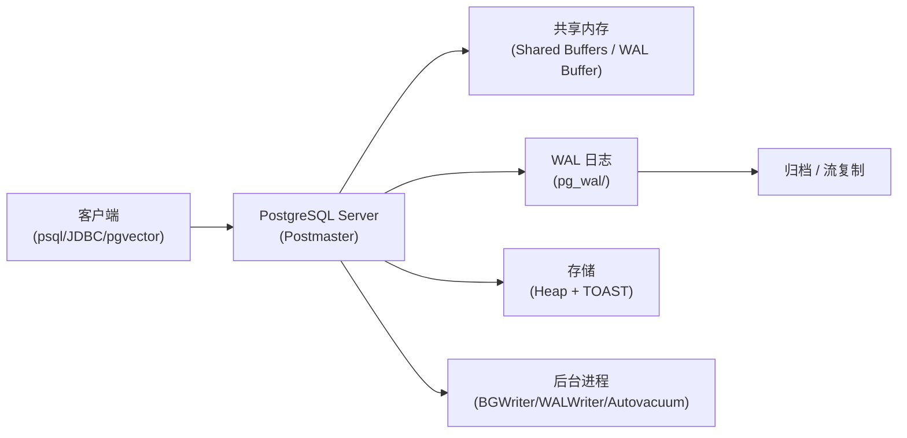

# PostgreSQL

## 技术定位

| 项 | 内容 |
|---|---|
| 技术名 | PostgreSQL |
| 一级类目 | OLAP 与数据库 |
| 二级类目 | 关系数据库 |
| 技术本体 | 开源对象关系型数据库，主要解决事务一致性、复杂查询、权限管理和可扩展性问题 |
| 全局架构位置 | 数据库层，承载 OLTP 写入、点查、关系查询；也可作为 OLAP 扩展（通过 pgvector、TimescaleDB 等插件）|
| 主要使用者 | 后端工程师、数据工程师、平台工程 |
| 主要产出 | 数据库实例、表/索引/视图、WAL 归档、高可用集群 |

## 官方锚点

- 官网：https://www.postgresql.org/
- GitHub：https://github.com/postgres/postgres
- 官方文档：https://www.postgresql.org/docs/current/
- WAL 文档：https://www.postgresql.org/docs/current/wal.html

## 架构图

> 基于本地文章描述整理，架构图有待精修时补充官方版本。

## 核心模块

| 模块 | 职责 | 重点问题 |
|---|---|---|
| 查询引擎 | 解析、规划、执行 SQL | 执行计划如何优化、统计信息如何维护 |
| 存储管理 | Heap 表、TOAST（大字段外存）、MVCC 版本 | TOAST 何时触发、大字段存储代价 |
| WAL 子系统 | 写前日志，保障崩溃恢复和流复制 | WAL 文件命名、归档策略、归档失败后果 |
| 权限系统 | 角色、授权、行级安全（RLS）| 权限链路：CREATE ROLE -> GRANT -> RLS |
| 高可用 | 流复制（Streaming Replication）、Patroni | 主从切换、failover、读写分离 |
| 扩展系统 | pgvector、PostgREST、pg_stat_statements 等 | 扩展与本体边界，插件带来的查询形态变化 |
| 发布订阅 | LISTEN/NOTIFY、逻辑复制 | 轻量级消息通知、与 Kafka 的边界 |

## 上下游

| 方向 | 对象 | 关系 |
|---|---|---|
| 上游 | 应用服务 / FastAPI / ORM | 写入和点查请求 |
| 上游 | ETL 工具（SeaTunnel、DataX）| 数据同步入库 |
| 下游 | 应用 / BI 工具 / 报表 | 查询结果消费 |
| 下游 | 流复制 Standby / pgvector 查询 | 读写分离、向量搜索 |
| 依赖 | 操作系统文件系统 | WAL 和存储依赖 fsync |

## 横向对标

| 对标技术 | 对标点 | 优势 | 劣势 | 使用判断 |
|---|---|---|---|---|
| MySQL | OLTP 关系数据库 | 扩展性强、SQL 标准更完整、支持复杂查询和 JSON | 小型 Web 应用生态略逊于 MySQL | 需要复杂查询、扩展插件、严格事务时选 PG |
| TiDB | 分布式 HTAP | PG 单机或小集群运维更简单 | 水平扩展能力弱于 TiDB | 数据量不超过单机上限且不需要水平扩展时选 PG |
| DuckDB | 嵌入式 OLAP 分析 | PG 更适合服务化、事务、更新 | DuckDB 本地列存分析性能更好 | 交互式分析场景可用 DuckDB；服务化场景选 PG |
| MongoDB | 文档型数据库 | PG JSONB 支持半结构化，不需要单独引入文档库 | MongoDB 更偏文档查询和水平扩展 | 同时需要事务和 JSON 时可先试 PG JSONB |

## 已沉淀核心知识点

| 主题 | 文件 | 问题指纹 | 解决什么问题 | 认知增量 |
|---|---|---|---|---|
| （待填入，精读候选处理后更新） | - | - | - | - |

## 本地文章索引

| 文章 | 技术对象 | 阅读投入建议 | 状态 |
|---|---|---|---|
| [5分钟看懂 PostgreSQL 工作原理](../文章/5分钟看懂%20PostgreSQL%20工作原理.md) | PostgreSQL 整体架构 | 精读 | 精读候选 |
| [PG数据库｜PostgreSQL WAL 文件全解析](../文章/PG数据库｜PostgreSQL%20WAL%20文件全解析：从命名规则到归档管理，一文吃透"生命线"逻辑！.md) | WAL | 精读 | 精读候选 |
| [PG数据库｜PostgreSQL上线参数调优](../文章/PG数据库｜PostgreSQL上线参数调优：企业级性能优化全攻略.md) | 参数调优 | 精读 | 待处理 |
| [PG数据库｜PostgreSQL权限管理深度解析](../文章/PG数据库｜PostgreSQL权限管理深度解析：从授权到合规的全链路实践.md) | 权限管理 | 精读 | 精读候选 |
| [PostgreSQL + pgvector AI 超级大脑配置指南](../文章/PostgreSQL%20+%20pgvector%20AI%20超级大脑配置指南.md) | pgvector 扩展 | 精读 | 待处理 |
| [PostgreSQL MCP Server](../文章/PostgreSQL%20MCP%20Server：让%20AI%20直接读懂你的数据库.md) | MCP 集成 | 略读 | 待处理 |
| [PostgreSQL 架构与内部机制介绍](../文章/PostgreSQL%20架构与内部机制介绍.md) | 整体架构 | 精读（原图缺失）| 精读候选 |
| [PostgreSQL 高可用学习指南](../文章/PostgreSQL%20高可用学习指南.md) | 高可用 | 精读 | 待处理 |
| [PostgreSQL对象DDL获取工具](../文章/PostgreSQL对象DDL获取工具.md) | 工具 | 略读 | 待处理 |
| [PostgreSQL教程（7）｜用户与权限管理](../文章/PostgreSQL教程（7）｜用户与权限管理.md) | 权限管理 | 精读 | 待处理 |
| [Postgres - 基于Listen_Notify构建轻量级发布订阅系统](../文章/Postgres%20-%20基于Listen_Notify构建轻量级发布订阅系统.md) | 发布订阅 | 精读 | 待处理 |
| [Python之FastAPI的入门到精通系列：同步连接Postgres](../文章/Python之FastAPI的入门到精通系列：同步连接Postgres.md) | FastAPI 集成 | 略读 | 待处理 |
| [SQL 写到崩溃？30 分钟开发 PostgreSQL Skill](../文章/SQL%20写到崩溃？30%20分钟开发%20PostgreSQL%20Skill，让%20AI%20接盘.md) | AI 工具集成（原图缺失）| 略读 | 待处理 |
| [体验 PostgreSQL 的 AI 扩展 pgvector](../文章/体验%20PostgreSQL%20的%20AI%20扩展%20pgvector.md) | pgvector | 精读 | 待处理 |
| [性能比拼: MySQL vs PostgreSQL](../文章/性能比拼_%20MySQL%20vs%20PostgreSQL.md) | 对标 MySQL | 精读 | 精读候选 |
| [我最爱的关系型开源数据库：postgres，强烈推荐！](../文章/我最爱的关系型开源数据库：postgres，强烈推荐！.md) | 综合推荐 | 略读 | 待处理 |
| [更轻更自由，还要什么自行车：PostgREST](../文章/更轻更自由，还要什么自行车：别急上Supabase，先试试它的内核PostgREST.md) | PostgREST | 精读 | 精读候选 |
| [用PostgreSQL搞定多模态数据：文本+图片Embedding实战](../文章/用PostgreSQL搞定多模态数据：文本+图片Embedding实战.md) | pgvector 实践 | 精读 | 待处理 |
| [简单解析下PostgreSQL的Toast](../文章/简单解析下PostgreSQL的Toast.md) | TOAST 存储 | 精读 | 精读候选 |

## 后续追查

- 关键词：WAL、TOAST、MVCC、pgvector、流复制、权限管理、PostgREST
- 待读资料：官方 WAL 文档、pgvector README、Patroni 文档
- 待补实验：pgvector 向量搜索最小复现；LISTEN/NOTIFY 与 Kafka 场景边界对比
