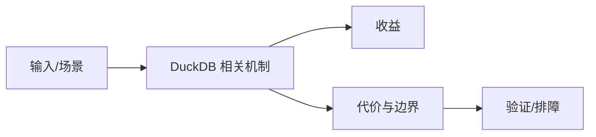

# MVCC 事务与嵌入式边界

## 来源
- [DuckDB：事务与 MVCC—— 嵌入式数据库也能有完整的 ACID 保证](<../文章/done-DuckDB：事务与 MVCC—— 嵌入式数据库也能有完整的 ACID 保证.md>)

## 核心问题
DuckDB 不是只读查询库，它也提供 ACID 和 MVCC，但它的事务能力服务于嵌入式分析和本地数据管理，不应外推成多用户服务型 OLTP 数据库。

## 判断准则
- 本地分析工作区、单进程嵌入和轻量写入可使用 DuckDB 事务。
- 多服务共享写、高并发在线事务、权限治理和 HA 仍应选 PostgreSQL/MySQL。

## 认知偏差
| 常见错误认知 | 正确理解 |
|---|---|
| 只要文章给了性能数字或最佳实践，就可以直接复用 | 必须确认版本、数据规模、查询/写入模式、硬件和失败场景 |
| 只按标题中的技术名归类 | 以正文主问题和技术本体归类 |
| 能跑通示例就等于生产可用 | 还要验证权限、恢复、监控、重试、成本和边界条件 |
| “嵌入式也有 ACID”不等于“可以替代服务端关系库”。 | 把它记录为降权或待验证点，而不是稳定结论 |

## 架构/流程图（如有）

## 待验证缺口
- 需要补 DuckDB 并发写、checkpoint 和文件锁官方边界。
