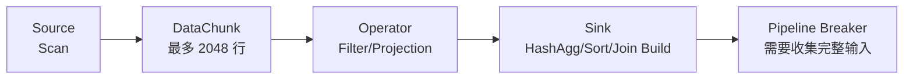

# DuckDB 向量化执行与 Pipeline

## 原文锚点

- 本地文件：[DuckDB：一条 SQL 是怎么被"一批一批"执行的？](<../文章/DuckDB：一条 SQL 是怎么被_一批一批_执行的？.md>)
- 原文链接：`https://mp.weixin.qq.com/s?__biz=MzUwOTU4OTU2NQ==&mid=2247483679&idx=1&sn=8f6d7a6e8250950bc4342b1e857f299b`
- 关键段落：火山模型、向量化执行、DataChunk、Push-Based Pipeline、Pipeline Breaker、MonetDB/X100 对比。
- 关键图：文章用文本图说明火山模型、DataChunk、Pipeline。

## 图片处理

| 图片 | 类型 | 是否保留 | 理由 | 处理方式 |
|---|---|---|---|---|
| 火山模型 vs 向量化模型 | 对比图 | 重建 | 有助于理解执行方式差异 | Mermaid 重建 |
| DataChunk 内存结构 | 说明图 | 重建 | 说明列向量和批大小 | 用文字和表格保留 |

## 一句话结论

这篇文章值得精读：DuckDB 快不是因为它“小”，而是因为它用列式存储、向量化 DataChunk 和 Push-Based Pipeline 提高 CPU 缓存、SIMD 和函数调用效率。

## 用户相关性判断

| 项 | 内容 |
|---|---|
| 用户当前认知层级 | DuckDB：L2 |
| 认知成熟度 | draft |
| 阅读投入建议 | 精读 |
| 阅读投入理由 | 能补 DuckDB 执行引擎的纵向模块，但没有真实 benchmark |
| 对用户的新信息 | DataChunk、Vector、Push-Based Pipeline 和 Pipeline Breaker 是理解 DuckDB 查询性能的关键 |
| 问题指纹 | DuckDB + 执行引擎 + DataChunk/Vector/Push-Based Pipeline + 本地分析性能 + 不等同传统行式执行 |
| 排重判断 | 新建 |
| 置信度 | 高 |

## 认知校准点

| 校准点 | 文章观点/信息 | 与用户认知或价值观的关系 | 处理建议 |
|---|---|---|---|
| DuckDB 本体是嵌入式 OLAP | 文章讲向量化执行，不是普通嵌入式事务库 | 补技术定位 | 放入 OLAP 与数据库 / 嵌入式分析 |
| 不要把 DuckDB 和 SQLite 等同 | SQLite 更偏轻量 OLTP，DuckDB 偏分析执行 | 横向对标价值高 | 写入 DuckDB index |
| Pipeline Breaker 是性能边界 | HashAgg、Sort、Hash Join Build 会切分 pipeline | 对排障和计划理解有价值 | 后续读执行计划时重点看 |
| 文章缺基准测试 | 主要用概念解释，没有跑结果 | 不能沉淀性能数字 | 只沉淀机制 |

## 冲突点

| 冲突类型 | 具体表现 | 影响 | 处理 |
|---|---|---|---|
| 证据不足 | 没有 benchmark 和硬件环境 | 不能写成性能结论 | 保留机制 |
| 实践门槛不足 | 有 SQL 但没有完整输出验证 | 不判实践 | 降为精读 |

## 待吸收点

| 分级 | 内容 | 为什么值得吸收 | 后续动作 |
|---|---|---|---|
| 理解 | 火山模型逐行 `next()`，函数调用和缓存效率差 | 解释 DuckDB 与传统行式执行差异 | 对比 PostgreSQL/SQLite |
| 理解 | DataChunk 是 DuckDB 的批处理单元，列向量连续存储 | 理解向量化执行核心 | 看源码和执行计划 |
| 记住 | 向量化执行减少函数调用、提升缓存命中、利用 SIMD | 会影响本地分析选型 | 写入 DuckDB index |
| 理解 | Push-Based Pipeline 通过 Source -> Operator -> Sink 推动 DataChunk | 解释执行流 | 后续补 Morsel-Driven 并行 |
| 记住 | HashAgg、Sort、Hash Join Build 是 Pipeline Breaker | 影响内存和延迟 | 读慢查询时关注 breaker |

## 已知可跳过

| 内容 | 跳过理由 |
|---|---|
| DuckDB 是本地数据库 | 基础已知 |
| 搬砖类比 | 帮助理解但不沉淀 |
| 系列文章推广 | 不进入知识点 |

## 实践门槛

| 门槛 | 判断 | 证据 |
|---|---|---|
| 可运行 | 部分 | 有建表和 EXPLAIN ANALYZE 示例 |
| 可验证 | 否 | 没有实际输出和对照结果 |
| 可排障 | 部分 | 能识别 Pipeline Breaker |
| 可迁移 | 是 | 可迁移到本地分析选型 |
| 结论 | 降为精读 | 后续补实验 |

## 归类判断

| 项 | 内容 |
|---|---|
| 技术本体 | DuckDB 执行引擎 |
| 文章主问题 | 一条 SQL 如何按 DataChunk 和 Pipeline 执行 |
| 使用场景 | 本地列式分析、嵌入式 OLAP |
| 关键词干扰 | SQL 执行也可归查询优化，但主角是 DuckDB 引擎 |
| 最终归类 | OLAP 与数据库 / 嵌入式分析 |
| 归类理由 | DuckDB 是嵌入式分析数据库，文章讲内部执行 |

## 技术定位

| 项 | 内容 |
|---|---|
| 技术类型 | 嵌入式 OLAP 执行引擎 |
| 所属领域 | OLAP 与数据库 |
| 二级类目 | 嵌入式分析 |
| 全局架构位置 | DuckDB 查询执行层 |
| 涉及模块 | DataChunk、Vector、Pipeline、Source、Operator、Sink、Pipeline Breaker |
| 解决问题 | 提高本地分析 SQL 的 CPU 执行效率 |
| 原文局限 | 缺 benchmark 和复杂查询案例 |
| 我的结论 | 以后关注，作为 DuckDB 执行引擎入口 |

## 纵向理解

| 维度 | 判断 |
|---|---|
| 全局架构 | SQL -> 优化器 -> Pipeline -> DataChunk 批处理 -> 输出 |
| 本文位置 | 执行引擎和批处理数据结构 |
| 核心机制 | 以 DataChunk 为单位批量传递列向量，减少逐行调用 |
| 使用链路 | 扫描文件/表 -> 过滤/投影 -> 聚合/排序/Join -> 输出 |
| 前置条件 | 分析型 workload、本地文件或嵌入式场景 |
| 边界 | 不替代服务化 OLAP 集群和高并发在线查询 |

## 横向对标

| 对标技术 | 实现方式 | 优势 | 劣势 | 适合场景 |
|---|---|---|---|---|
| 火山模型 | 每行 `next()` 拉取 | 实现简单，传统成熟 | 函数调用多、缓存差 | 传统行式数据库 |
| DuckDB 向量化 | DataChunk 批处理 | CPU 友好，适合分析 | Pipeline Breaker 仍需收集数据 | 本地 OLAP |
| 编译执行 | 代码生成专用执行 | 极致优化潜力 | 实现复杂、编译开销 | 高性能引擎特定场景 |

## 后续追查

- 关键词：DuckDB DataChunk、Vectorized Execution、Pipeline Breaker、Morsel-Driven。
- 相关技术：MonetDB/X100、Vectorwise、ClickHouse 向量化执行。
- 需要补读的文章：DuckDB 并行执行与 Morsel-Driven 调度、DuckDB MVCC、DuckDB 优化器。
