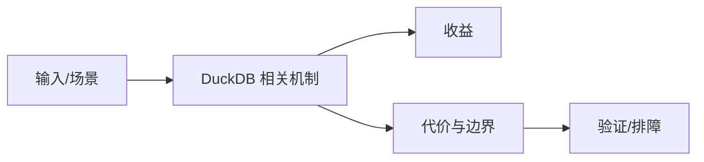

# 并行 Join 与优化器边界

## 来源
- [DuckDB：并行执行与 Morsel-Driven 调度-多核 CPU 是怎么被充分利用的？](<../文章/done-DuckDB：并行执行与 Morsel-Driven 调度-多核 CPU 是怎么被充分利用的？.md>)
- [最高加速4.7万倍！如何重构经典Join算法让DuckDB跑得更快](<../文章/done-最高加速4.7万倍！如何重构经典Join算法让DuckDB跑得更快.md>)
- [聊聊duckdb的Eager Aggregate Execution](<../文章/done-聊聊duckdb的Eager Aggregate Execution.md>)
- [DuckDB CTE 完全指南：从基础到高级优化，解锁递归查询新姿势](<../文章/done-DuckDB CTE 完全指南：从基础到高级优化，解锁递归查询新姿势.md>)
- [DuckDB：你可能不知道的 SQL 超能力](<../文章/done-DuckDB：你可能不知道的 SQL 超能力.md>)

## 核心问题
DuckDB 的本地分析性能不仅来自向量化，也来自 Morsel-Driven 并行、Join 算法、Eager Aggregate、CTE/递归优化等执行策略。优化器和执行器的关键是把单机 CPU、缓存和文件扫描充分利用起来。

## 判断准则
- 本地大文件分析先看数据格式、谓词下推、Join 规模和并行度。
- CTE/递归/复杂 SQL 能否快，取决于是否被优化器改写和物化成本。

## 认知偏差
| 常见错误认知 | 正确理解 |
|---|---|
| 只要文章给了性能数字或最佳实践，就可以直接复用 | 必须确认版本、数据规模、查询/写入模式、硬件和失败场景 |
| 只按标题中的技术名归类 | 以正文主问题和技术本体归类 |
| 能跑通示例就等于生产可用 | 还要验证权限、恢复、监控、重试、成本和边界条件 |
| “加速 4.7 万倍”必须降权，只保留算法重构和适用条件。 | 把它记录为降权或待验证点，而不是稳定结论 |

## 架构/流程图（如有）

## 待验证缺口
- 需要用 DuckDB EXPLAIN ANALYZE 验证不同 Join 和聚合路径。
