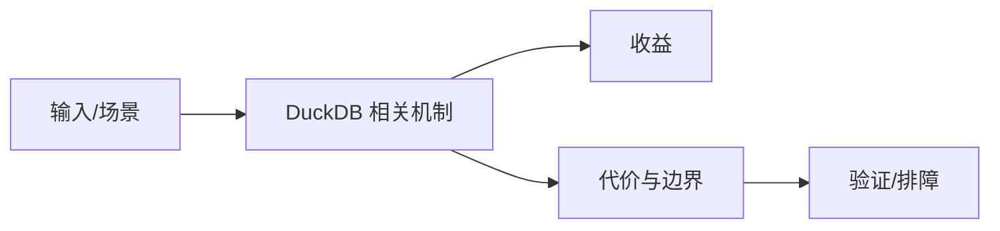

# 扩展机制与生态边界

## 来源
- [DuckDB Extensions：让本地分析更强大的秘密武器](<../文章/done-DuckDB Extensions：让本地分析更强大的秘密武器.md>)
- [DuckDB 插件开发实战：Mac 版 Everything](<../文章/done-DuckDB 插件开发实战：Mac 版 Everything.md>)
- [Duck-UI：一款基于浏览器的DuckDB开发工具](<../文章/done-Duck-UI：一款基于浏览器的DuckDB开发工具.md>)
- [Python库巡礼--DuckDB](<../文章/done-Python库巡礼--DuckDB.md>)

## 核心问题
DuckDB 扩展让它连接更多文件格式、远端系统和特定函数能力，但扩展生态的价值取决于安装来源、版本兼容、安全和是否能融入本地分析工作流。

## 判断准则
- 生产或长期工作流里使用扩展，要固定版本和来源，避免隐式下载安装导致不可复现。
- 浏览器/UI 工具只是使用入口，不改变 DuckDB 作为嵌入式分析引擎的本体。

## 认知偏差
| 常见错误认知 | 正确理解 |
|---|---|
| 只要文章给了性能数字或最佳实践，就可以直接复用 | 必须确认版本、数据规模、查询/写入模式、硬件和失败场景 |
| 只按标题中的技术名归类 | 以正文主问题和技术本体归类 |
| 能跑通示例就等于生产可用 | 还要验证权限、恢复、监控、重试、成本和边界条件 |
| 插件商店式表达容易忽略扩展权限和版本锁定。 | 把它记录为降权或待验证点，而不是稳定结论 |

## 架构/流程图（如有）

## 待验证缺口
- 需要补官方扩展安全模型和离线部署方式。
