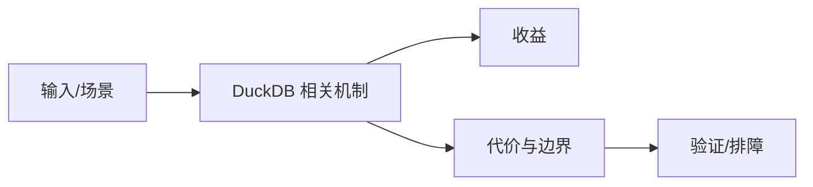

# 本地 ETL 与分析场景边界

## 来源
- [pg_duckdb：PostgreSQL 与 DuckDB 的初体验](<../文章/done-pg_duckdb：PostgreSQL 与 DuckDB 的初体验.md>)
- [从 75 秒到 0.24 秒：Polars_DuckDB 的魅力](<../文章/done-从 75 秒到 0.24 秒：Polars_DuckDB 的魅力.md>)
- [重新思考数据工程：DuckDB 如何重塑 ETL 与 ELT](<../文章/done-重新思考数据工程：DuckDB 如何重塑 ETL 与 ELT.md>)
- [使用 DuckDB 进行基本特征工程](<../文章/done-使用 DuckDB 进行基本特征工程.md>)
- [轻量级文本分析利器：DuckDB 实战关键词与语义搜索](<../文章/done-轻量级文本分析利器：DuckDB 实战关键词与语义搜索.md>)
- [高速量化回测：把你的复杂因子存进 DuckDB，一次计算永久使用](<../文章/done-高速量化回测：把你的复杂因子存进 DuckDB，一次计算永久使用.md>)
- [OpenClaw-Observability：基于 DuckDB 构建 OpenClaw 的全链路可观测体系](<../文章/done-OpenClaw-Observability：基于 DuckDB 构建 OpenClaw 的全链路可观测体系.md>)

## 核心问题
DuckDB 适合把本地文件、Notebook、轻量 ETL、特征工程、文本分析、回测和可观测数据快速组织成 SQL 可分析的数据集。它的边界是单机资源、数据生命周期、并发访问和是否需要服务化治理。

## 判断准则
- 本地一次性分析、文件扫描和轻量 ELT 可优先试 DuckDB。
- 长期共享数据产品、多人并发、权限审计和高可用仍需要服务端数据库或数仓。

## 认知偏差
| 常见错误认知 | 正确理解 |
|---|---|
| 只要文章给了性能数字或最佳实践，就可以直接复用 | 必须确认版本、数据规模、查询/写入模式、硬件和失败场景 |
| 只按标题中的技术名归类 | 以正文主问题和技术本体归类 |
| 能跑通示例就等于生产可用 | 还要验证权限、恢复、监控、重试、成本和边界条件 |
| “告别大栈”只适合低协作、低治理成本场景；企业数据链路仍要考虑血缘、权限和调度。 | 把它记录为降权或待验证点，而不是稳定结论 |

## 架构/流程图（如有）

## 待验证缺口
- 需要补 DuckDB 与 Polars/Pandas/PostgreSQL 的同工作负载对比。
