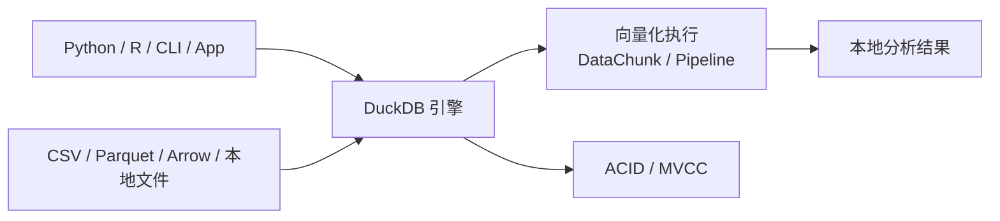

# DuckDB
## 知识点入口

- 本模块先看宏观流程，再看文章：[知识地图](040301_知识地图.md)。
- 新文章必须先归入流程节点，再判断是补充、冲突、不同层次还是降权。
- `文章/` 只保留原文锚点，长期知识必须沉淀到 `040301_核心知识点/` 下的主题文件。

## 技术定位

| 项 | 内容 |
|---|---|
| 技术名 | DuckDB |
| 一级类目 | OLAP 与数据库 |
| 二级类目 | 嵌入式分析 |
| 技术本体 | 面向本地分析、嵌入式分析和列式 OLAP 的进程内数据库 |
| 全局架构位置 | 位于应用进程、Notebook、本地文件和轻量分析任务之间，承担本地列式查询和分析计算 |
| 主要使用者 | 数据分析师、数据工程师、后端工程师、分析应用工程师 |
| 主要产出 | 本地查询结果、Parquet/CSV 分析、嵌入式分析能力 |

## 官方锚点

- 官网：[DuckDB](https://duckdb.org/)
- GitHub：[duckdb/duckdb](https://github.com/duckdb/duckdb)
- 官方文档：[DuckDB Docs](https://duckdb.org/docs/)

## 架构图

## 核心模块

| 模块 | 职责 | 重点问题 |
|---|---|---|
| 列式存储 | 提高分析扫描效率 | 压缩、文件格式、Parquet 互操作 |
| 向量化执行 | 批量处理 DataChunk | CPU 缓存、SIMD、pipeline breaker |
| 优化器 | 改写和优化 SQL | 统计信息、join order、谓词下推 |
| 扩展机制 | 扩展数据源和功能 | 安全、版本、生态质量 |
| ACID/MVCC | 嵌入式事务能力 | 并发边界、写入模式 |

## 横向对标

| 对标技术 | 对标点 | DuckDB 优势 | DuckDB 劣势 | 使用判断 |
|---|---|---|---|---|
| SQLite | 嵌入式数据库 | DuckDB 更适合 OLAP 和列式扫描 | SQLite OLTP 生态更强 | 本地分析用 DuckDB，轻事务应用用 SQLite |
| PostgreSQL | 通用关系数据库 | DuckDB 本地分析轻量 | 不适合多用户服务型 OLTP | 服务端业务库用 PostgreSQL |
| ClickHouse | 列式 OLAP | DuckDB 部署轻、嵌入式 | 不适合大规模服务化集群 | 单机/本地分析用 DuckDB，集群查询用 ClickHouse |
| Pandas | 本地数据分析 | DuckDB SQL 和文件扫描强 | DataFrame 生态交互不同 | 大文件 SQL 分析可优先 DuckDB |

## 已沉淀核心知识点

| 主题 | 文件 | 问题指纹 | 解决什么问题 | 认知增量 |
|---|---|---|---|---|
| 向量化执行与 Pipeline | [DuckDB向量化执行与Pipeline](040301_核心知识点/DuckDB向量化执行与Pipeline.md) | DuckDB + 向量化执行与 Pipeline + 机制/边界/验证 | DuckDB 的性能来自 DataChunk、向量化执行、Pipeline 和本地列式扫描。 | 形成可复用判断，不保留文章池 |
| 并行 Join 与优化器边界 | [DuckDB并行Join与优化器边界](040301_核心知识点/DuckDB并行Join与优化器边界.md) | DuckDB + 并行 Join 与优化器边界 + 机制/边界/验证 | DuckDB 的本地分析性能不仅来自向量化，也来自 Morsel-Driven 并行、Join 算法、Eager Aggregate、CTE/递归优化等执行策略 | 形成可复用判断，不保留文章池 |
| MVCC 事务与嵌入式边界 | [DuckDBMVCC事务与嵌入式边界](040301_核心知识点/DuckDBMVCC事务与嵌入式边界.md) | DuckDB + MVCC 事务与嵌入式边界 + 机制/边界/验证 | DuckDB 不是只读查询库，它也提供 ACID 和 MVCC，但它的事务能力服务于嵌入式分析和本地数据管理，不应外推成多用户服务型 OLTP 数据库 | 形成可复用判断，不保留文章池 |
| 扩展机制与生态边界 | [DuckDB扩展机制与生态边界](040301_核心知识点/DuckDB扩展机制与生态边界.md) | DuckDB + 扩展机制与生态边界 + 机制/边界/验证 | DuckDB 扩展让它连接更多文件格式、远端系统和特定函数能力，但扩展生态的价值取决于安装来源、版本兼容、安全和是否能融入本地分析工作流 | 形成可复用判断，不保留文章池 |
| 本地 ETL 与分析场景边界 | [DuckDB本地ETL与分析场景边界](040301_核心知识点/DuckDB本地ETL与分析场景边界.md) | DuckDB + 本地 ETL 与分析场景边界 + 机制/边界/验证 | DuckDB 适合把本地文件、Notebook、轻量 ETL、特征工程、文本分析、回测和可观测数据快速组织成 SQL 可分析的数据集 | 形成可复用判断，不保留文章池 |
## 后续追查

- 关键词：DataChunk、Vectorized Execution、Push-Based Pipeline、Pipeline Breaker、Morsel-Driven Parallelism。
- 待读资料：DuckDB 优化器、MVCC、扩展机制、pg_duckdb。
- 待补实验：用 CSV/Parquet 和 Pandas/PostgreSQL 对比本地聚合、过滤和 Join。
