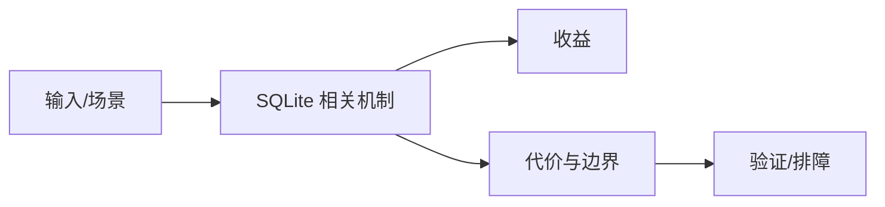

# 单文件数据库边界

## 来源
- [SQLite 又被重新看见：为什么 2026 年大家开始怀念一个单文件数据库？](<../文章/done-SQLite 又被重新看见：为什么 2026 年大家开始怀念一个单文件数据库？.md>)
- [果不其然，SQLite的研究引来一堆人的关注，上一篇爆了](<../文章/done-果不其然，SQLite的研究引来一堆人的关注，上一篇爆了.md>)

## 核心问题
SQLite 的重新被关注，本质是本地优先、低运维、单文件、读多写少和小团队部署成本的再平衡。它适合本地应用、内部工具、边缘设备和单应用服务器，不适合多服务共享写、高并发写入和复杂权限治理。

## 判断准则
- 选择 SQLite 前先确认单写者、文件锁、备份和迁移是否可接受。
- 与 DuckDB 区分：SQLite 更偏事务型本地状态，DuckDB 更偏本地列式分析。

## 认知偏差
| 常见错误认知 | 正确理解 |
|---|---|
| 只要文章给了性能数字或最佳实践，就可以直接复用 | 必须确认版本、数据规模、查询/写入模式、硬件和失败场景 |
| 只按标题中的技术名归类 | 以正文主问题和技术本体归类 |
| 能跑通示例就等于生产可用 | 还要验证权限、恢复、监控、重试、成本和边界条件 |
| “2026 年怀念单文件数据库”是趋势表达，不是技术结论。 | 把它记录为降权或待验证点，而不是稳定结论 |

## 架构/流程图（如有）

## 待验证缺口
- 需要补 WAL、锁、STRICT 表和备份 API 官方文档。
