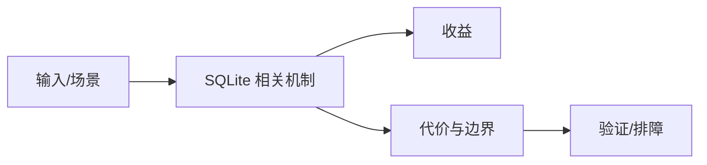

# 消息队列扩展边界

## 来源
- [不到 300 Star！SQLite 竟内置消息队列，作者凭什么这么狂](<../文章/done-不到 300 Star！SQLite 竟内置消息队列，作者凭什么这么狂.md>)

## 核心问题
SQLite 可以通过表结构、触发器或扩展承载轻量队列，但这只适合低吞吐、本地可靠性要求可控、业务已经依赖 SQLite 的场景。它不替代 Kafka、Redis Stream 或专门消息队列。

## 判断准则
- 只在单机、本地、低吞吐、简单消费者场景评估 SQLite 队列。
- 需要消费组、回放、分区、高吞吐、跨服务可靠投递时使用专门消息系统。

## 认知偏差
| 常见错误认知 | 正确理解 |
|---|---|
| 只要文章给了性能数字或最佳实践，就可以直接复用 | 必须确认版本、数据规模、查询/写入模式、硬件和失败场景 |
| 只按标题中的技术名归类 | 以正文主问题和技术本体归类 |
| 能跑通示例就等于生产可用 | 还要验证权限、恢复、监控、重试、成本和边界条件 |
| “内置消息队列”容易误导，必须确认是 SQLite 本体能力、扩展还是项目封装。 | 把它记录为降权或待验证点，而不是稳定结论 |

## 架构/流程图（如有）

## 待验证缺口
- 需要补项目源码、锁冲突和崩溃恢复实验。
