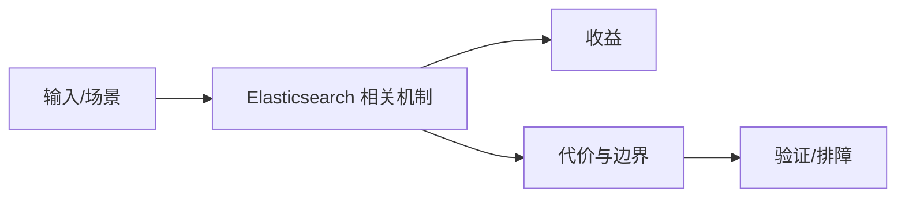

# 倒排索引与写入可见性

## 来源
- [面试官：ES倒排索引如何实现？详细描述一下 ES 索引文档的过程？ES如何保证并发下读写一致？ES如何实现master选举？](<../文章/done-面试官：ES倒排索引如何实现？详细描述一下 ES 索引文档的过程？ES如何保证并发下读写一致？ES如何实现master选举？.md>)
- [字节面试： es怎么提升性能和精准度？（尼恩独家，史上最全）](<../文章/done-字节面试： es怎么提升性能和精准度？（尼恩独家，史上最全）.md>)

## 核心问题
Elasticsearch 的索引不是关系库 B-tree，而是基于 Lucene Segment 的倒排结构。写入后要经历内存缓冲、refresh、segment 可见、flush/translog 持久化等阶段，所以“写入成功”和“搜索可见”不是同一件事。

## 判断准则
- 排查搜索延迟先区分 refresh 间隔、segment merge、查询 DSL 和分片热点。
- 精准度问题先看分词、mapping、字段类型和相关性评分，而不是盲目扩容。

## 认知偏差
| 常见错误认知 | 正确理解 |
|---|---|
| 只要文章给了性能数字或最佳实践，就可以直接复用 | 必须确认版本、数据规模、查询/写入模式、硬件和失败场景 |
| 只按标题中的技术名归类 | 以正文主问题和技术本体归类 |
| 能跑通示例就等于生产可用 | 还要验证权限、恢复、监控、重试、成本和边界条件 |
| 面试题文章可做机制入口，但不能替代官方 Refresh/Flush/Translog 文档。 | 把它记录为降权或待验证点，而不是稳定结论 |

## 架构/流程图（如有）

## 待验证缺口
- 需要补 Lucene Segment、refresh 和 translog 官方锚点。
