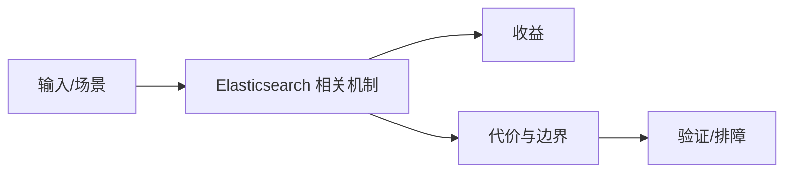

# 搜索平台与文件检索边界

## 来源
- [SpringBoot + Minio + ElasticSearch实现文件内容检索](<../文章/done-SpringBoot + Minio + ElasticSearch实现文件内容检索.md>)
- [基于ES的搜索平台在哈啰的应用](<../文章/done-基于ES的搜索平台在哈啰的应用.md>)

## 核心问题
ES 搜索平台通常包含采集解析、对象存储、索引建模、查询服务、权限和运维治理。文件内容检索案例的价值不在 SpringBoot 代码，而在 Minio/解析结果/索引字段/查询入口的链路划分。

## 判断准则
- 搜索平台沉淀重点是 mapping、索引生命周期、权限过滤和查询治理。
- SpringBoot 集成代码如果不改变搜索链路，只作为锚点，不新建技术知识点。

## 认知偏差
| 常见错误认知 | 正确理解 |
|---|---|
| 只要文章给了性能数字或最佳实践，就可以直接复用 | 必须确认版本、数据规模、查询/写入模式、硬件和失败场景 |
| 只按标题中的技术名归类 | 以正文主问题和技术本体归类 |
| 能跑通示例就等于生产可用 | 还要验证权限、恢复、监控、重试、成本和边界条件 |
| 平台案例容易把业务工程代码和搜索机制混在一起，蒸馏时要抽出索引与查询准则。 | 把它记录为降权或待验证点，而不是稳定结论 |

## 架构/流程图（如有）

## 待验证缺口
- 需要补索引生命周期、分片规划和权限过滤方案。
