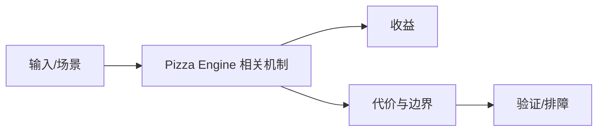

# 嵌入式搜索边界

## 来源
- [让搜索能力像 SQLite 一样无处不在](<../文章/done-让搜索能力像 SQLite 一样无处不在.md>)

## 核心问题
Pizza Engine 当前只能作为“嵌入式搜索能力候选”记录。文章主张让搜索像 SQLite 一样无处不在，但是否成立取决于开源状态、索引结构、中文分词、写入更新、查询性能和浏览器/本地运行约束。

## 判断准则
- 没有源码、架构和基准前，不把它当稳定技术方案。
- 本地结构化数据库内全文检索要先对比 SQLite FTS；服务化搜索仍看 Elasticsearch/OpenSearch。

## 认知偏差
| 常见错误认知 | 正确理解 |
|---|---|
| 只要文章给了性能数字或最佳实践，就可以直接复用 | 必须确认版本、数据规模、查询/写入模式、硬件和失败场景 |
| 只按标题中的技术名归类 | 以正文主问题和技术本体归类 |
| 能跑通示例就等于生产可用 | 还要验证权限、恢复、监控、重试、成本和边界条件 |
| “像 SQLite 一样无处不在”是定位口号，不是工程结论。 | 把它记录为降权或待验证点，而不是稳定结论 |

## 架构/流程图（如有）

## 待验证缺口
- 需要补项目地址、索引结构、性能基线和与 Tantivy/Lucene/SQLite FTS 对比。
