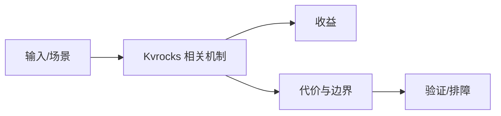

# Redis 兼容持久化 KV 边界

## 来源
- [Apache Kvrocks 2.14.0 版本发布](<../文章/done-Apache Kvrocks 2.14.0 版本发布.md>)

## 核心问题
Kvrocks 的选型点不是“比 Redis 新”，而是 Redis 协议兼容与 RocksDB 持久化容量之间的取舍。它适合需要 Redis 接口生态但内存成本或持久化规模压力较大的场景。

## 判断准则
- 低延迟纯内存和丰富数据结构优先 Redis；大容量持久 KV 且可接受 RocksDB 延迟时评估 Kvrocks。
- 版本发布只记录能力线索，必须用官方 Release Notes 校验具体变化。

## 认知偏差
| 常见错误认知 | 正确理解 |
|---|---|
| 只要文章给了性能数字或最佳实践，就可以直接复用 | 必须确认版本、数据规模、查询/写入模式、硬件和失败场景 |
| 只按标题中的技术名归类 | 以正文主问题和技术本体归类 |
| 能跑通示例就等于生产可用 | 还要验证权限、恢复、监控、重试、成本和边界条件 |
| 版本通告不能直接转成生产准则。 | 把它记录为降权或待验证点，而不是稳定结论 |

## 架构/流程图（如有）

## 待验证缺口
- 需要补 2.14.0 官方发布说明、兼容矩阵和 RocksDB 参数。
