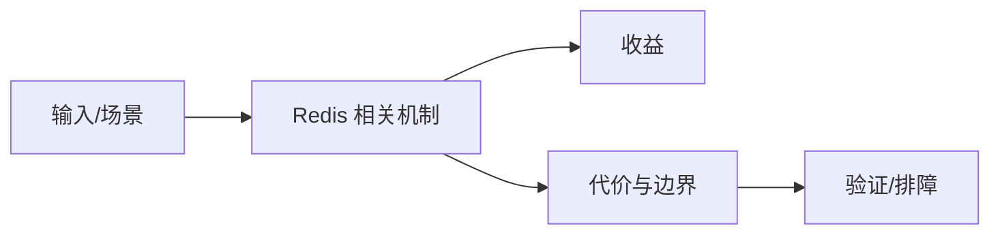

# Pipeline 与 Lua 原子操作边界

## 来源
- [Redis 为什么要引入 Pipeline机制？十分钟带你掌握！](<../文章/done-Redis 为什么要引入 Pipeline机制？十分钟带你掌握！.md>)
- [绝佳组合 Lua + Redis + SpringBoot = 王炸！](<../文章/done-绝佳组合 Lua + Redis + SpringBoot = 王炸！.md>)

## 核心问题
Pipeline 和 Lua 解决的是不同问题：Pipeline 减少网络往返但不保证一组命令原子；Lua 脚本在 Redis 单线程执行路径内提供原子组合，但会带来脚本阻塞、调试困难和主从复制语义风险。

## 判断准则
- 批量独立命令优先 Pipeline；需要条件判断和原子组合时考虑 Lua。
- Lua 脚本必须控制执行时间和 key 访问范围，避免阻塞 Redis。

## 认知偏差
| 常见错误认知 | 正确理解 |
|---|---|
| 只要文章给了性能数字或最佳实践，就可以直接复用 | 必须确认版本、数据规模、查询/写入模式、硬件和失败场景 |
| 只按标题中的技术名归类 | 以正文主问题和技术本体归类 |
| 能跑通示例就等于生产可用 | 还要验证权限、恢复、监控、重试、成本和边界条件 |
| “王炸组合”要降权，真正准则是网络往返、原子性和阻塞风险的取舍。 | 把它记录为降权或待验证点，而不是稳定结论 |

## 架构/流程图（如有）

## 待验证缺口
- 需要补 Redis 脚本复制和集群 key slot 限制。
