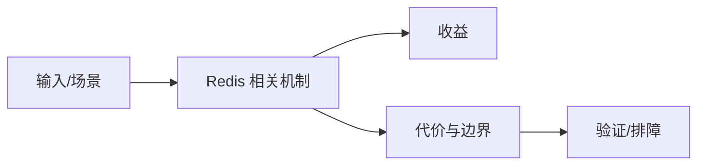

# 持久化与高可用边界

## 来源
- [Redis 持久化策略浅析](<../文章/done-Redis 持久化策略浅析.md>)
- [异地双活：哈啰四轮出行的落地- redis](<../文章/done-异地双活：哈啰四轮出行的落地- redis.md>)
- [Redis8.0来袭，大数据点查询之王重磅发布！](<../文章/done-Redis8.0来袭，大数据点查询之王重磅发布！.md>)

## 核心问题
Redis 持久化和高可用不是一个开关：RDB、AOF、混合持久化影响丢失窗口、fork 成本和恢复速度；双活方案还要处理跨地域延迟、冲突、降级和一致性边界。版本文章只记录能力线索。

## 判断准则
- 缓存可丢场景和状态不可丢场景要使用不同持久化策略。
- 异地双活必须明确冲突解决、流量切换和故障回放，不能只看架构图。

## 认知偏差
| 常见错误认知 | 正确理解 |
|---|---|
| 只要文章给了性能数字或最佳实践，就可以直接复用 | 必须确认版本、数据规模、查询/写入模式、硬件和失败场景 |
| 只按标题中的技术名归类 | 以正文主问题和技术本体归类 |
| 能跑通示例就等于生产可用 | 还要验证权限、恢复、监控、重试、成本和边界条件 |
| “点查询之王”类版本文案必须用官方和基准校验。 | 把它记录为降权或待验证点，而不是稳定结论 |

## 架构/流程图（如有）

## 待验证缺口
- 需要补 Redis 8 官方变化和双活冲突处理细节。
