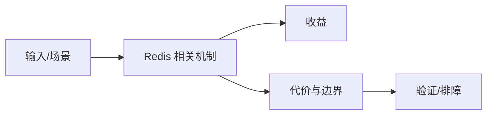

# 数据结构与 RocksDB 边界

## 来源
- [Redis 高级数据类型实战指南：超越 String 和 Hash 的 5 大利器](<../文章/done-Redis 高级数据类型实战指南：超越 String 和 Hash 的 5 大利器.md>)
- [图解Redis](<../文章/done-图解Redis.md>)
- [存储引擎的左右手：读懂Redis与RocksDB的设计哲学](<../文章/done-存储引擎的左右手：读懂Redis与RocksDB的设计哲学.md>)

## 核心问题
Redis 的核心优势是内存数据结构和低延迟访问；RocksDB 的核心优势是持久化 KV 和写优化存储。两者不是谁替代谁，而是缓存/短状态和持久大容量 KV 的不同取舍。

## 判断准则
- 排行榜、计数、集合关系、位图、HyperLogLog 等短状态优先看 Redis 数据结构。
- 超出内存规模、强持久化、写放大可接受时看 RocksDB/Kvrocks。

## 认知偏差
| 常见错误认知 | 正确理解 |
|---|---|
| 只要文章给了性能数字或最佳实践，就可以直接复用 | 必须确认版本、数据规模、查询/写入模式、硬件和失败场景 |
| 只按标题中的技术名归类 | 以正文主问题和技术本体归类 |
| 能跑通示例就等于生产可用 | 还要验证权限、恢复、监控、重试、成本和边界条件 |
| 把 Redis 当数据库长期存所有状态，或者把 RocksDB 当缓存，都容易错配。 | 把它记录为降权或待验证点，而不是稳定结论 |

## 架构/流程图（如有）

## 待验证缺口
- 需要补内存估算、淘汰策略和 RocksDB 写放大对比。
