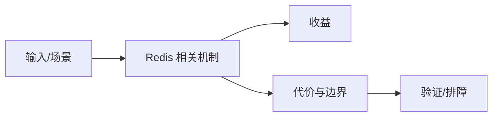

# 高时延可观测排障

## 来源
- [可观测性实战：快速定位 Redis 应用高时延问题](<../文章/done-可观测性实战：快速定位 Redis 应用高时延问题.md>)

## 核心问题
Redis 高时延排障要沿着客户端、网络、命令、服务端事件循环、慢日志、内存和持久化路径拆解。只看服务端 CPU 或平均延迟容易漏掉连接池、热点 key、阻塞命令和 fork。

## 判断准则
- 先用慢日志、latency doctor、命令统计和客户端 Trace 定位是哪一段慢。
- 大 key、阻塞命令、AOF rewrite、RDB fork 和网络抖动是优先排查项。

## 认知偏差
| 常见错误认知 | 正确理解 |
|---|---|
| 只要文章给了性能数字或最佳实践，就可以直接复用 | 必须确认版本、数据规模、查询/写入模式、硬件和失败场景 |
| 只按标题中的技术名归类 | 以正文主问题和技术本体归类 |
| 能跑通示例就等于生产可用 | 还要验证权限、恢复、监控、重试、成本和边界条件 |
| 可观测性文章只有给出指标、日志和定位闭环时才值得精读。 | 把它记录为降权或待验证点，而不是稳定结论 |

## 架构/流程图（如有）

## 待验证缺口
- 需要补 Redis 官方 latency 指标和常用命令。
