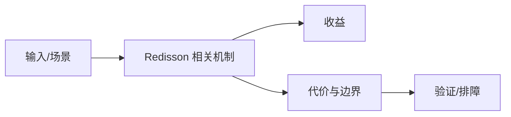

# 分布式锁语义与 Watchdog 边界

## 来源
- [分布式锁工具Redisson，太香了！！](<../文章/done-分布式锁工具Redisson，太香了！！.md>)

## 核心问题
Redisson 的价值是把 Redis 分布式锁、可重入、自动续期、等待唤醒等能力封装成 Java API。它降低使用门槛，但锁语义仍受 Redis 可用性、客户端宕机、网络分区、主从切换和 Watchdog 续期影响。

## 判断准则
- 单 Redis 锁适合短临界区和可接受偶发失败的场景；强一致互斥要评估数据库锁、ZooKeeper/etcd 或业务幂等。
- Watchdog 解决长任务续期，但不能解决网络分区和主从切换下的所有安全问题。

## 认知偏差
| 常见错误认知 | 正确理解 |
|---|---|
| 只要文章给了性能数字或最佳实践，就可以直接复用 | 必须确认版本、数据规模、查询/写入模式、硬件和失败场景 |
| 只按标题中的技术名归类 | 以正文主问题和技术本体归类 |
| 能跑通示例就等于生产可用 | 还要验证权限、恢复、监控、重试、成本和边界条件 |
| “太香”标题降权，核心看锁释放、续期、重入和异常路径。 | 把它记录为降权或待验证点，而不是稳定结论 |

## 架构/流程图（如有）

## 待验证缺口
- 需要补 Redisson 官方锁实现和 Redis 故障切换实验。
