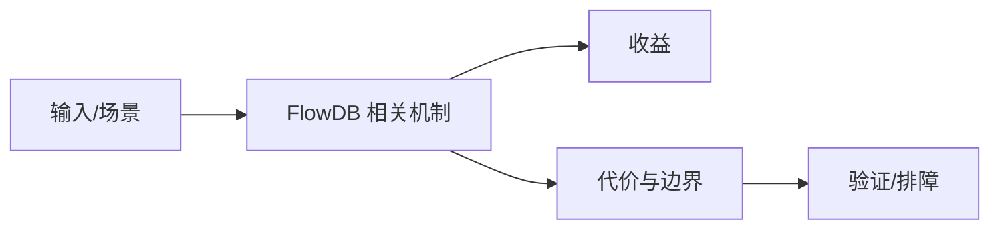

# 时序存储引擎待验证边界

## 来源
- [FlowDB 架构解析：Rust 的时序存储引擎为什么能比C++的RocksDB快好几倍](<../文章/done-FlowDB 架构解析：Rust 的时序存储引擎为什么能比C++的RocksDB快好几倍.md>)

## 核心问题
FlowDB 当前更适合作为“时序存储引擎设计案例”而不是稳定选型结论。文章声称通过 Rust、时序约束、索引、Compaction 和 TTL 取得性能优势，但缺少可复现基准、源码和负载条件时不能采信“比 RocksDB 快几倍”的结论。

## 判断准则
- 只吸收时序场景约束如何改变写路径、索引和 Compaction 设计。
- 性能结论必须有版本、硬件、数据模型、读写比例和基准脚本。

## 认知偏差
| 常见错误认知 | 正确理解 |
|---|---|
| 只要文章给了性能数字或最佳实践，就可以直接复用 | 必须确认版本、数据规模、查询/写入模式、硬件和失败场景 |
| 只按标题中的技术名归类 | 以正文主问题和技术本体归类 |
| 能跑通示例就等于生产可用 | 还要验证权限、恢复、监控、重试、成本和边界条件 |
| 标题性能对比强营销，必须降权。 | 把它记录为降权或待验证点，而不是稳定结论 |

## 架构/流程图（如有）

## 待验证缺口
- 待补源码、论文、基准和与 RocksDB 的同负载对比。
