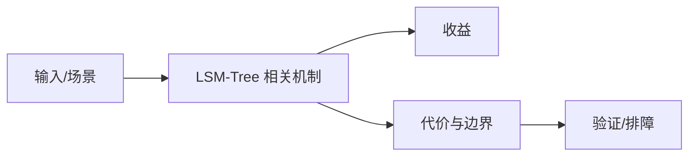

# WAL、MemTable、SSTable 与 Compaction 边界

## 来源
- [LSM数据结构在大数据领域的应用](<../文章/done-LSM数据结构在大数据领域的应用.md>)
- [数据全生命周期：WAL 的原子保证、MemTable 的并发跳表设计](<../文章/done-数据全生命周期：WAL 的原子保证、MemTable 的并发跳表设计.md>)
- [数据库筑基课-高能长文说说LSM-Tree](<../文章/done-数据库筑基课-高能长文说说LSM-Tree.md>)
- [跟着论文学习数据库4：LSM-tree 数据结构](<../文章/done-跟着论文学习数据库4：LSM-tree 数据结构.md>)

## 核心问题
LSM-Tree 用写入先进入 WAL/MemTable、顺序落盘 SSTable、后台 Compaction 的方式换取高写吞吐。代价是读可能跨多层文件、Compaction 带来写放大和空间放大、后台合并可能影响延迟。

## 判断准则
- 写多读少、批量写、可接受后台整理的 KV/宽表/日志类系统适合 LSM。
- 读延迟敏感时要关注 Bloom Filter、Block Index、层级策略和 Compaction 积压。

## 认知偏差
| 常见错误认知 | 正确理解 |
|---|---|
| 只要文章给了性能数字或最佳实践，就可以直接复用 | 必须确认版本、数据规模、查询/写入模式、硬件和失败场景 |
| 只按标题中的技术名归类 | 以正文主问题和技术本体归类 |
| 能跑通示例就等于生产可用 | 还要验证权限、恢复、监控、重试、成本和边界条件 |
| “LSM 写快”只讲了前半句，后半句是读放大、写放大和空间放大的偿还。 | 把它记录为降权或待验证点，而不是稳定结论 |

## 架构/流程图（如有）

## 待验证缺口
- 需要补 leveled/size-tiered/universal compaction 的差异。
