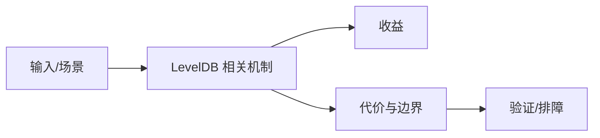

# 最小 LSM 文件组织与恢复路径

## 来源
- [LevelDB：一个最小 LSM 引擎如何组织数据](<../文章/done-LevelDB：一个最小 LSM 引擎如何组织数据.md>)

## 核心问题
LevelDB 的价值在于展示一个最小 LSM 引擎如何把 WAL、MemTable、Immutable MemTable、SSTable、Manifest 和 Version 管理串起来。它适合学习存储引擎，不适合直接对标 RocksDB 的生产能力。

## 判断准则
- 学习 LSM 先用 LevelDB 理解写入、Flush、Manifest 和恢复，再看 RocksDB 的工程化增强。
- 不要把 LevelDB 的简洁实现外推成高并发、多列族、复杂调参能力。

## 认知偏差
| 常见错误认知 | 正确理解 |
|---|---|
| 只要文章给了性能数字或最佳实践，就可以直接复用 | 必须确认版本、数据规模、查询/写入模式、硬件和失败场景 |
| 只按标题中的技术名归类 | 以正文主问题和技术本体归类 |
| 能跑通示例就等于生产可用 | 还要验证权限、恢复、监控、重试、成本和边界条件 |
| “最小实现”是学习优势，不是生产优势。 | 把它记录为降权或待验证点，而不是稳定结论 |

## 架构/流程图（如有）

## 待验证缺口
- 需要补 Manifest/VersionEdit 和崩溃恢复流程图。
