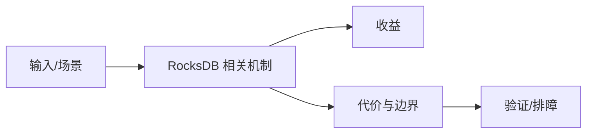

# Compaction 读写空间放大边界

## 来源
- [RocksDB：Compaction 是如何工作的](<../文章/done-RocksDB：Compaction 是如何工作的.md>)

## 核心问题
RocksDB Compaction 负责清理旧版本、合并 SST、控制层级和降低读放大。它也会带来写放大、空间放大、IO 抢占和 Write Stall，是 RocksDB 调优的核心。

## 判断准则
- 写入抖动先看 L0 文件数、Compaction 积压、后台线程和磁盘 IO。
- 读慢先看 Bloom Filter、Block Cache、层级重叠和 key 分布。

## 认知偏差
| 常见错误认知 | 正确理解 |
|---|---|
| 只要文章给了性能数字或最佳实践，就可以直接复用 | 必须确认版本、数据规模、查询/写入模式、硬件和失败场景 |
| 只按标题中的技术名归类 | 以正文主问题和技术本体归类 |
| 能跑通示例就等于生产可用 | 还要验证权限、恢复、监控、重试、成本和边界条件 |
| Compaction 不是后台无成本清理，而是把写入债务显式偿还。 | 把它记录为降权或待验证点，而不是稳定结论 |

## 架构/流程图（如有）

## 待验证缺口
- 需要补 RocksDB 官方 Compaction Style、Write Stall 和 Block Cache 参数。
