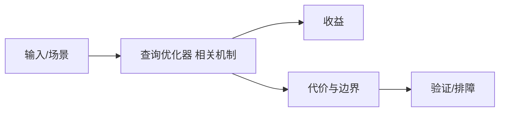

# CBO 与学习型优化边界

## 来源
- [AI如何破解数据库查询优化的“真实世界”难题？](<../文章/done-AI如何破解数据库查询优化的“真实世界”难题？.md>)
- [Calcite - 探索 Relation Algebra (关系代数)](<../文章/done-Calcite - 探索 Relation Algebra (关系代数).md>)
- [Calcite - 探索让集合可以像表一样查询](<../文章/done-Calcite - 探索让集合可以像表一样查询.md>)

## 核心问题
查询优化器的本体是把 SQL 转成关系代数、逻辑计划和物理计划，再用统计信息、基数估算、搜索剪枝和代价模型选择执行路径。学习型优化试图改进真实工作负载下的估计偏差，但它依赖训练数据、计划表示、线上反馈和可解释性。

## 判断准则
- 通用优化器知识放这里；具体 MySQL/PostgreSQL/Doris/StarRocks 慢 SQL 放对应技术节点。
- AI 优化器文章必须看是否有真实工作负载、可复现实验和线上安全策略。

## 认知偏差
| 常见错误认知 | 正确理解 |
|---|---|
| 只要文章给了性能数字或最佳实践，就可以直接复用 | 必须确认版本、数据规模、查询/写入模式、硬件和失败场景 |
| 只按标题中的技术名归类 | 以正文主问题和技术本体归类 |
| 能跑通示例就等于生产可用 | 还要验证权限、恢复、监控、重试、成本和边界条件 |
| “AI 破解查询优化”容易夸大学习模型作用，传统统计信息和代价模型仍是生产核心。 | 把它记录为降权或待验证点，而不是稳定结论 |

## 架构/流程图（如有）

## 待验证缺口
- 需要补 JOB-Complex、QueryFormer 原论文和 Calcite 官方文档。
