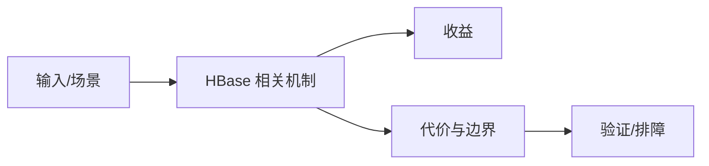

# Compaction 与低延时调优边界

## 来源
- [HBase 实践 _ 货拉拉 HBase Compaction 调优实践](<../文章/done-HBase 实践 _ 货拉拉 HBase Compaction 调优实践.md>)
- [如何提升 HBase 大规模集群下的低延时性能](<../文章/done-如何提升 HBase 大规模集群下的低延时性能.md>)
- [HBase 实践 _ HBase 重复空列名数据的 RT 规律抖动问题](<../文章/done-HBase 实践 _ HBase 重复空列名数据的 RT 规律抖动问题.md>)

## 核心问题
HBase 低延时问题常来自 Region 分布、HFile 数量、BlockCache、Compaction、数据异常和 Flush 抖动。Compaction 调优要在读放大、写放大、低峰资源和业务高峰之间平衡。

## 判断准则
- 先用监控定位是读路径、写路径、Compaction 还是数据异常导致延迟。
- Major Compaction 不应在业务高峰盲目执行；要结合 HFile 大小、数量和低峰窗口。

## 认知偏差
| 常见错误认知 | 正确理解 |
|---|---|
| 只要文章给了性能数字或最佳实践，就可以直接复用 | 必须确认版本、数据规模、查询/写入模式、硬件和失败场景 |
| 只按标题中的技术名归类 | 以正文主问题和技术本体归类 |
| 能跑通示例就等于生产可用 | 还要验证权限、恢复、监控、重试、成本和边界条件 |
| “低延时调优”不能只给参数清单，必须有现象、指标、定位和回滚。 | 把它记录为降权或待验证点，而不是稳定结论 |

## 架构/流程图（如有）

## 待验证缺口
- 需要补 RegionServer 指标、BlockCache 命中率和 Compaction 队列信号。
