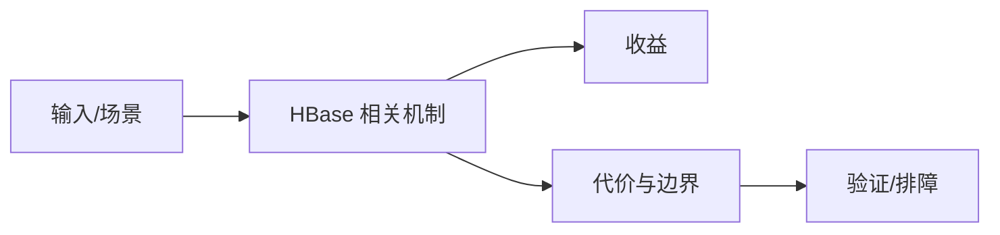

# Meta 与 Replication 运维排障边界

## 来源
- [HBase Meta 元信息表修复实践](<../文章/done-HBase Meta 元信息表修复实践.md>)
- [HBase运维｜Replication 阻塞异常排查](<../文章/done-HBase运维｜Replication 阻塞异常排查.md>)

## 核心问题
HBase 运维高风险点集中在 meta 表、Region 分配、协处理器异常和 Replication 线程阻塞。修复 meta 或热部署排查 Replication 都是高风险操作，必须先保留证据、确认影响范围和准备回滚。

## 判断准则
- meta 修复前先确认 Region 状态、HBCK 报告、备份和目标表影响范围。
- Replication 阻塞要先看 jstack、队列、WAL、Peer 状态和异常日志，不要直接重启掩盖现场。

## 认知偏差
| 常见错误认知 | 正确理解 |
|---|---|
| 只要文章给了性能数字或最佳实践，就可以直接复用 | 必须确认版本、数据规模、查询/写入模式、硬件和失败场景 |
| 只按标题中的技术名归类 | 以正文主问题和技术本体归类 |
| 能跑通示例就等于生产可用 | 还要验证权限、恢复、监控、重试、成本和边界条件 |
| 排障实践有价值，但命令必须结合版本和集群状态，不能照抄。 | 把它记录为降权或待验证点，而不是稳定结论 |

## 架构/流程图（如有）

## 待验证缺口
- 需要补 HBase 2.x 官方 HBCK2、Replication 监控和恢复文档。
