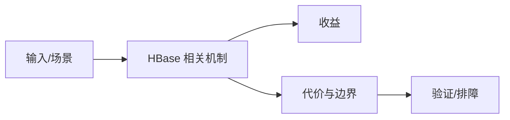

# HBase 入仓边界

## 来源
- [HBase海量数据高效入仓解决方案](<../文章/done-HBase海量数据高效入仓解决方案.md>)

## 核心问题
HBase 入仓的主问题不是“能不能扫 HBase”，而是如何减少业务库压力、处理字段变更、增量时间戳、回溯和权限治理。Hive 映射表、全表扫描、rowKey get、Phoenix 二级索引等方案各有代价。

## 判断准则
- 全表扫描会压 HBase，增量方案要验证时间戳可靠性和字段变更感知。
- 入仓链路要有回溯、补数、权限和 Schema 演进处理。

## 认知偏差
| 常见错误认知 | 正确理解 |
|---|---|
| 只要文章给了性能数字或最佳实践，就可以直接复用 | 必须确认版本、数据规模、查询/写入模式、硬件和失败场景 |
| 只按标题中的技术名归类 | 以正文主问题和技术本体归类 |
| 能跑通示例就等于生产可用 | 还要验证权限、恢复、监控、重试、成本和边界条件 |
| 入仓方案若只展示吞吐，不说明业务侧压力和字段变更，会误导选型。 | 把它记录为降权或待验证点，而不是稳定结论 |

## 架构/流程图（如有）

## 待验证缺口
- 需要与数据集成目录的 CDC/批同步方案对齐。
