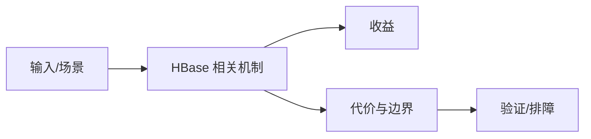

# 写入链路、MemStore Flush 与 HFile 边界

## 来源
- [HBase写入全流程剖析](<../文章/done-HBase写入全流程剖析.md>)
- [V6.0新增面试题-HBase为什么有列族](<../文章/done-V6.0新增面试题-HBase为什么有列族.md>)

## 核心问题
HBase 写入链路从 Region 定位、WAL、MemStore 到 Flush 生成 HFile，再由 Compaction 合并。列族不是简单逻辑分组，而是影响存储局部性、Flush、Compaction 和读取放大的物理边界。

## 判断准则
- 列族数量要少且按访问模式划分，避免无关列族共同放大 Flush/Compaction。
- 写入吞吐问题先看 WAL、MemStore、Flush 频率、Region 热点和 HFile 数量。

## 认知偏差
| 常见错误认知 | 正确理解 |
|---|---|
| 只要文章给了性能数字或最佳实践，就可以直接复用 | 必须确认版本、数据规模、查询/写入模式、硬件和失败场景 |
| 只按标题中的技术名归类 | 以正文主问题和技术本体归类 |
| 能跑通示例就等于生产可用 | 还要验证权限、恢复、监控、重试、成本和边界条件 |
| 面试式“列族提高效率”过于简化，真正边界是物理文件和访问模式。 | 把它记录为降权或待验证点，而不是稳定结论 |

## 架构/流程图（如有）

## 待验证缺口
- 需要补官方 HFile、MemStore Flush 和列族设计文档。
