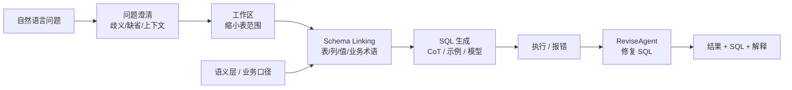

# Text-to-SQL 工程架构与 Schema Linking

## 知识点本体

Text-to-SQL 的关键判断不是“模型能不能把自然语言翻译成 SQL”，而是智能问数系统能不能把业务问题、语义层、Schema Linking、SQL 生成、执行校验和结果解释连成可追责链路。

这个知识点用于持续吸收多篇 Text-to-SQL / ChatBI / 智能问数 / 语义层文章。来源文章可以补充机制、提出冲突观点、增加案例或提供更高层次的架构理解，但最终都要沉淀到这个知识点的判断框架里。

## 来源贡献

| 来源 | 贡献类型 | 贡献内容 | 处理 |
|---|---|---|---|
| [万字长文详解Text-to-SQL](../文章/done-万字长文详解Text-to-SQL.md) | 基线 + 补充 | 提供场景分类、五类挑战、问题澄清、工作区划分、ReviseAgent、推理增强、Schema Linking | 作为当前知识点的第一版基线 |
| [AutoLink](../文章/done-AutoLink：工业级 Text-to-SQL 的 schema自主探索革命 —— 重新定义大模型时代的 schema链接范式.md) / [Neo4j+Text2SQL](../文章/done-Neo4j+Text2SQL：大模型秒懂表关系，SQL准确率狂飙300%的实战指南.md) | 补充 | 强化 Schema Linking、表关系图谱和 Join 路径识别 | 合并到 Schema Linking 判断 |
| [复刻 OpenAI Data Agent 的语义层](../文章/done-复刻 OpenAI Data Agent 的语义层：Metadata Pipeline 设计与实践.md) / [ktx 语义层查数仓](../文章/done-ktx：让 Claude Code 别再写 SQL，改用语义层查数仓.md) | 层次升级 | 把问数从生成 SQL 提升到语义层、元数据和指标口径约束 | 合并到语义层与口径节点 |
| [ChatBI 幻觉终结者](../文章/done-ChatBI的“幻觉”终结者：我们如何将答案准确率从70%提升到95%+？.md) / [智能问数 100% 准确](../文章/done-智能问数 Agent 如何确保 SQL 生成 100% 准确？.md) | 冲突 + 校准 | 准确率收益需要场景、基线、验收和失败样例 | 保留为校准点，不直接采信标题数字 |

## 批量重蒸馏来源

| 来源组 | 文章 | 吸收方式 |
|---|---|---|
| ChatBI 最小实现 | [Doris + DeepSeek + Dify](../文章/done-0代码！教会你用Doris+DeepSeek+Dify搭建ChatBI系统（附完整DSL）.md)、[Doris MCP + LangChain](<../文章/done-3步！教会你用 Doris MCP + LangChain 搭建AI问数系统（保姆级教程）.md>)、[Dify 动态可视化](<../文章/done-ChatBI ｜在 Dify中实现动态智能的数据可视化.md>) | 只吸收“连接数据源、约束 SQL、返回结果和可视化”的链路位置，不采信低代码可直接生产可用的暗示 |
| 智能问数产品链路 | [AI Agent 问数智能报表](../文章/done-AI Agent应用--问数--智能报表.md)、[AI 驱动智能问数](../文章/done-AI 驱动下的智能问数，将BI嵌入到聊天中.md)、[AI+BI 对话式报表](../文章/done-AI+BI：结合大语言模型实现对话式的智能报表系统.md)、[ChatAgent](../文章/done-ChatAgent智能问数及数据源管理功能.md)、[AskTable](../文章/done-AskTable 再进化！多文件联查｜准确率｜信创｜阿里云.md) | 作为产品形态样例，沉淀到问题澄清、数据源管理、权限和解释追责节点 |
| 开源框架与工具 | [DB-GPT](../文章/done-DB-GPT：蚂蚁开源的Text-to-SQL利器.md)、[SQLBot](../文章/done-SQLBot：一款基于大语言模型和RAG的智能数据分析工具.md)、[SeekDB](../文章/done-SeekDB：让每个数据人都能成为“问数”高手的开源利器.md)、[腾讯音乐 ChatBI](../文章/done-Text2SQL新体验 — 腾讯音乐开源的ChatBI框架.md)、[Spring AI Alibaba NL2SQL](../文章/done-开源ChatBI ： Spring AI Alibaba 的中文NL2SQL智能引擎.md)、[企业级治理智能体](<../文章/done-【开源】19.3K Star ，告别手写 SQL：这个智能体用自然语言直达可视化与 AI 洞察，企业级治理也能私有化落地.md>) | 降到架构模块对照：语义层、RAG、执行沙箱、可视化、权限和审计 |
| Schema 与语义建模 | [表格理解 TabClaw](../文章/done-TabClaw：让 AI 真正读懂你的表格数据.md)、[TailorSQL](../文章/done-TailorSQL：让大模型更懂你的数据库，NL2SQL准确率翻倍.md)、[Vanna 优化](../文章/done-Text2SQL之Vanna优化.md)、[Text2SQL 实战](../文章/done-Text2SQL实战（上）：基于RAG从0到1打造一个简单的对话式数据分析agent.md)、[Text2SQL 关系图谱](../文章/done-Text2SQL进阶：自动化构建表关系图谱，告别手动维护的噩梦.md)、[语义数据建模、图查询与 SQL](../文章/done-语义数据建模、图查询与SQL的融合：Google最新报告解读.md) | 强化“Schema 不是 DDL 文本，而是表、列、值、业务术语、Join 路径和指标口径”的判断 |
| 生产校准与交互 | [ChatBI 翻车自白](../文章/done-一个数据总监的ChatBI翻车自白：我们都想错了.md)、[NL2SQL 技术突破](../文章/done-一文看懂NL2SQL技术突破背后的故事.md)、[制造业 NL2MQL](../文章/done-从NL2SQL到NL2MQL：制造业AI智能问数的架构思考.md)、[DeepAgents MySQL 助手](../文章/done-企业级 MySQL 数据分析助手落地方案：基于 DeepAgents 的全流程实践.md)、[LLM 在 Text2SQL 的应用](../文章/done-大模型LLM在Text2SQL上的应用实践.md)、[SQLBot 智能问数系统](../文章/done-大模型text2sql，SQLBot智能问数系统，基于LLM和RAG技术，支持数据即问即答.md)、[SQL 知识库与智能下钻](../文章/done-效率飙升！数分师的AI新玩具：打造SQL知识库，解锁智能下钻自由.md)、[避坑 ChatBI 幻觉](../文章/done-避坑ChatBI的“AI幻觉”：3个方法让智能分析不离线.md)、[Quick BI 架构](<../文章/done-阿里发布新版 Quick BI，聊聊 ChatBI 的底层架构、交互设计和云计算生态.md>)、[TiDB Chat2Query](<../文章/done-TiDB Chat2Query 深度解析：我们如何打造一款更高效、准确的智能 SQL 生成工具？.md>)、[LangChain 动态选模](<../文章/done-LangChain v1 Agent：DeepSeek-V3.2_V3.2-Speciale在ChatBI里动态选模.md>) | 作为可信问数的失败模式和工程边界来源：准确率、幻觉、方言、成本、选模、解释和人工复核都要显式验收 |

## 原文锚点

- 本地文件：[万字长文详解Text-to-SQL](../文章/done-万字长文详解Text-to-SQL.md)
- 原文链接：`http://mp.weixin.qq.com/s?__biz=MzAxOTQ5MjExNQ==&mid=2247483879&idx=1&sn=b488b78ecda2bad6b662ca1da1c27748`
- 关键段落：场景分类、五类挑战、问题澄清、工作区划分、ReviseAgent、推理增强、Schema Linking。
- 关键图：正文提到架构图和多张示意图，但 Markdown 缺失。

## 图片处理

| 图片                            | 类型     | 是否保留 | 理由          | 处理方式            |
| ----------------------------- | ------ | ---- | ----------- | --------------- |
| Text-to-SQL 场景分类图、挑战映射图、总体架构图 | 架构/对比图 | 原图缺失 | 是理解文章结构的关键图 | Mermaid 重建简化架构图 |

## 一句话结论

当前来源应从“机器学习目录”重路由到“数据分析与 BI”：Text-to-SQL 的难点不是模型会不会写 SQL，而是业务语义、Schema Linking、执行校验和人机协作能否形成可追责问数链路。

## 用户相关性判断

| 项 | 内容 |
|---|---|
| 用户当前认知层级 | Text-to-SQL / 智能问数：L2-L3 |
| 认知成熟度 | draft |
| 阅读投入建议 | 精读 |
| 阅读投入理由 | 当前来源能补智能问数的工程拆解，但 90% 准确率等判断缺场景基线 |
| 对用户的新信息 | Schema Linking、工作区划分、问题澄清、ReviseAgent 是 Text-to-SQL 工程化核心 |
| 问题指纹 | Text-to-SQL + Schema Linking/澄清/ReviseAgent/语义层 + SQL 准确性 + 可追责问数 |
| 排重判断 | 建立知识点基线；后续来源优先合并，除非讨论的是语义层、权限、评估等独立知识点 |
| 置信度 | 中 |

## 认知校准点

| 校准点 | 文章观点/信息 | 与用户认知或价值观的关系 | 处理建议 |
|---|---|---|---|
| 不是机器学习主线 | 原文在机器学习目录，但主问题是业务问数系统 | 分类偏差 | 重路由到数据分析与 BI |
| Prompt + DDL 是最小版，不是生产版 | 原文说简单 prompt 在 BIRD 上有一定执行准确率 | 补足工程边界 | 只能作为 baseline |
| Schema Linking 是核心 | 文章把值、列、表、业务术语链接作为重点 | 符合用户重系统位置 | 写入 Text-to-SQL index |
| 复杂查询应先工程化降复杂 | 作者提到维度建模可降低 join 复杂度 | 与数仓经验强相关 | 记住：先治理模型，再指望模型 |
| “90% 以上准确率”要降权 | 文中说具体场景实现全量能力可做到 90%+ | 缺数据集、场景、口径、验收 | 标记待验证，不写成结论 |

## 冲突与层次判断

| 后续来源类型 | 需要判断的问题 | 处理方式 |
|---|---|---|
| 补充机制 | 是否新增 Schema Linking、语义层、SQL 修复、执行校验或权限机制 | 合并到对应章节，补充来源贡献 |
| 观点冲突 | 是否声称“只靠模型/Prompt 即可生产可用”或“100% 准确” | 写入认知校准点并降权，要求场景、基线、验收 |
| 层次升级 | 是否从单点 SQL 生成提升到语义层、元数据管道、问数产品链路 | 更新知识点本体或拆出更高层知识点 |
| 只是案例 | 是否只展示产品效果，没有新增机制和边界 | 只保留为例子或不吸收 |

## 冲突点

| 冲突类型 | 具体表现 | 影响 | 处理 |
|---|---|---|---|
| 原目录冲突 | 原文放在机器学习 | 会把问数系统误解成模型训练问题 | 重路由 |
| 图片缺失 | 架构图、挑战图缺失 | 影响理解整体架构 | 重建简图 |
| 证据不足 | 准确率和方法效果缺具体业务验收 | 不能直接采信 | 写成待验证 |

## 待吸收点

| 分级 | 内容 | 为什么值得吸收 | 后续动作 |
|---|---|---|---|
| 理解 | Text-to-SQL 场景要按 SQL 复杂度和准确性要求分区 | 防止对所有问数场景使用同一标准 | 产品定位先分辅助开发和业务自助 |
| 理解 | 问题澄清应处理歧义、缺省、代指和上下文 | 业务问题常不完整 | 后续设计多轮澄清 |
| 理解 | 工作区划分可缩小表范围，降低模型知识负载 | 与数仓建模强相关 | 用业务域/数据域做工作区 |
| 记住 | Schema Linking 要链接表、列、值、业务术语，而不是只检索表名 | 直接影响 SQL 准确性 | 作为智能问数核心准则 |
| 记住 | ReviseAgent 要基于执行错误修复 SQL，但必须限制重试和沙箱权限 | 防止错误 SQL 失控 | 后续补 SQL sandbox |
| 了解 | CoT、Self Consistency、候选 SQL 选择能提高复杂查询能力 | 属于模型增强方向 | 暂不作为第一优先级 |

## 已知可跳过

| 内容 | 跳过理由 |
|---|---|
| Text-to-SQL 是自然语言转 SQL | 用户已知 |
| LLM 比传统方法效果更好 | 过于泛化，缺业务场景 |
| 游戏样例 | 只用于说明推理增强，不沉淀为核心 |

## 实践门槛

| 门槛 | 判断 | 证据 |
|---|---|---|
| 可运行 | 否 | 没有完整系统代码 |
| 可验证 | 部分 | 有执行准确率概念和挑战拆解 |
| 可排障 | 部分 | 提出 ReviseAgent 和错误修复 |
| 可迁移 | 是 | 可迁移到智能问数架构设计 |
| 结论 | 降为精读 | 作为架构准则，不直接实践 |

## 归类判断

| 项 | 内容 |
|---|---|
| 技术本体 | Text-to-SQL / 智能问数 |
| 文章主问题 | 如何提升自然语言转 SQL 的准确性和工程可用性 |
| 使用场景 | 业务问数、自助分析、SQL 辅助开发 |
| 关键词干扰 | LLM、微调、BIRD、Spider 容易误归到 LLM 或机器学习 |
| 最终归类 | 数据分析与 BI / 语义层与智能问数 |
| 归类理由 | 目标是业务数据查询和分析，不是模型训练本身 |

## 可复用结论

| 结论 | 使用方式 |
|---|---|
| 先治理语义层和元数据，再讨论模型生成 SQL | 读智能问数文章时先看是否有口径、表字段描述、业务术语和权限 |
| Schema Linking 要覆盖表、列、值、业务术语 | 只检索表名或只塞 DDL 的方案只能算 baseline |
| SQL Agent 必须有执行沙箱、重试上限和结果解释 | 没有安全和追责链路时不能直接给业务决策使用 |
| 准确率数字必须绑定场景、数据集、口径和验收方式 | 无基线数字不写成稳定结论 |

## 技术定位

| 项 | 内容 |
|---|---|
| 技术类型 | 智能问数系统能力 |
| 所属领域 | 数据分析与 BI |
| 二级类目 | 语义层与智能问数 |
| 全局架构位置 | 业务问题到数据库查询之间的语义转换层 |
| 涉及模块 | 问题澄清、工作区、Schema Linking、SQL 生成、执行修复、语义层 |
| 解决问题 | 降低业务查询门槛，同时控制 SQL 准确性和追责 |
| 原文局限 | 图缺失，准确率结论缺场景基线 |
| 我的结论 | 以后关注，作为智能问数架构主线 |

## 纵向理解

| 维度 | 判断 |
|---|---|
| 全局架构 | 问题 -> 澄清 -> 工作区 -> Schema Linking -> SQL 生成 -> 执行校验 -> 结果解释 |
| 本文位置 | Text-to-SQL 全链路拆解，重点在 Schema Linking |
| 核心机制 | 将自然语言关键词映射到业务术语、表、列和值，再生成 SQL |
| 使用链路 | 先治理语义层和元数据，再接模型生成与修复 |
| 前置条件 | 表字段描述、业务术语、指标口径、权限、执行沙箱 |
| 边界 | 无语义层和校验时不适合给业务人员直接决策 |

## 横向对标

| 对标技术 | 实现方式 | 优势 | 劣势 | 适合场景 |
|---|---|---|---|---|
| BI 语义层 | 预定义指标和维度 | 准确、可追责 | 灵活性受限 | 高价值经营指标 |
| Text-to-SQL | LLM 生成 SQL | 灵活、低门槛 | 准确性和安全风险 | 探索式问数和辅助开发 |
| SQL Agent | 工具调用执行 SQL 并修复 | 可闭环验证 | 权限和成本风险 | 工程化问数助手 |
| 人工 SQL | 分析师编写 | 质量高、上下文强 | 成本高 | 复杂分析和高风险决策 |

## 后续追查

- 关键词：Schema Linking、ReviseAgent、QueryGPT、BIRD、Spider、SQL sandbox、semantic layer。
- 相关技术：DB-GPT、AutoLink、OmniSQL、NL2MQL、指标平台。
- 需要补读的文章：制造业 NL2MQL、AutoLink、DB-GPT、AIData 智能问数。
