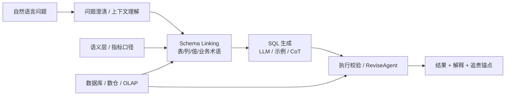

# Text-to-SQL
## 知识点入口

- 本模块先看宏观流程，再看文章：[知识地图](050101_知识地图.md)。
- 新文章必须先归入流程节点，再判断是补充、冲突、不同层次还是降权。
- `文章/` 只保留原文锚点，长期知识必须沉淀到 `050101_核心知识点/` 下的主题文件。

## 技术定位

| 项 | 内容 |
|---|---|
| 技术名 | Text-to-SQL |
| 一级类目 | 数据分析与 BI |
| 二级类目 | 语义层与智能问数 |
| 技术本体 | 将自然语言问题转换为可执行 SQL，并返回可解释、可追责的数据结果 |
| 全局架构位置 | 位于业务问题、语义层、数据库和 BI/问数入口之间 |
| 主要使用者 | 数据分析师、业务人员、BI 平台、数据应用工程师 |
| 主要产出 | SQL、执行结果、解释、引用表字段、校验记录 |

## 官方锚点

- 官网：无单一官网，属于任务与系统能力
- 典型数据集：Spider、BIRD、WikiSQL
- 相关项目：DB-GPT、XiYan-SQL、Vanna、LangChain SQL Agent

## 架构图

## 核心模块

| 模块 | 职责 | 重点问题 |
|---|---|---|
| 问题澄清 | 补足时间、范围、指标、维度 | 多轮对话、歧义识别 |
| Schema Linking | 关联自然语言、表、列、值、业务术语 | 召回准确率、中文同义词、业务词典 |
| SQL 生成 | 生成符合方言的 SQL | 复杂 Join、窗口函数、模型随机性 |
| SQL 修复 | 根据执行错误修正 SQL | 最大重试、错误分类、沙箱执行 |
| 语义层 | 固化指标口径和业务定义 | 口径冲突、权限、版本 |
| 评估 | 衡量执行准确率和业务正确性 | 数据集不等于真实业务 |

## 横向对标

| 对标技术 | 对标点 | 优势 | 劣势 | 使用判断 |
|---|---|---|---|---|
| 传统 BI 拖拽 | 自助分析 | 稳定、可控 | 灵活性低，需要懂数据模型 | 固定报表和常规分析 |
| Text-to-SQL | 自然语言查数 | 门槛低，探索性强 | 准确性和追责难 | 有语义层和校验时适合辅助问数 |
| 语义层查询 | 指标口径查询 | 口径稳定 | 表达能力受限 | 高准确业务指标 |
| 数据分析师写 SQL | 人工分析 | 质量和上下文强 | 人力成本高 | 复杂分析和决策场景 |

## 已沉淀核心知识点

| 主题 | 文件 | 问题指纹 | 解决什么问题 | 认知增量 |
|---|---|---|---|---|
| Text-to-SQL 工程架构与 Schema Linking | [Text-to-SQL工程架构与SchemaLinking](050101_核心知识点/Text-to-SQL工程架构与SchemaLinking.md) | Text-to-SQL + Schema Linking/澄清/ReviseAgent/语义层 + SQL 准确性 + 可追责问数 | Text-to-SQL 为什么不能只靠 Prompt + DDL | 把智能问数从“模型生成 SQL”校准为“语义层、链接、校验和人机协作系统” |
| Text-to-SQL 数据构造与评测边界 | [Text-to-SQL数据构造与评测边界](050101_核心知识点/Text-to-SQL数据构造与评测边界.md) | Text-to-SQL + 合成数据/数据清洗/歧义澄清/执行评测 + 线上验收 | 为什么榜单分数不能直接代表业务问数质量 | 把训练和评测校准为“数据质量、执行校验、歧义澄清和业务口径共同约束”的系统问题 |

## 后续追查

- 关键词：Schema Linking、BIRD、Spider、ReviseAgent、QueryGPT、semantic layer、SQL sandbox。
- 待读资料：智能问数架构、NL2MQL、AutoLink、OmniSQL、DB-GPT、AmbiSQL。
- 待补实验：拿一个真实指标问题，验证表/列/值 linking、SQL 执行和口径解释链路。
