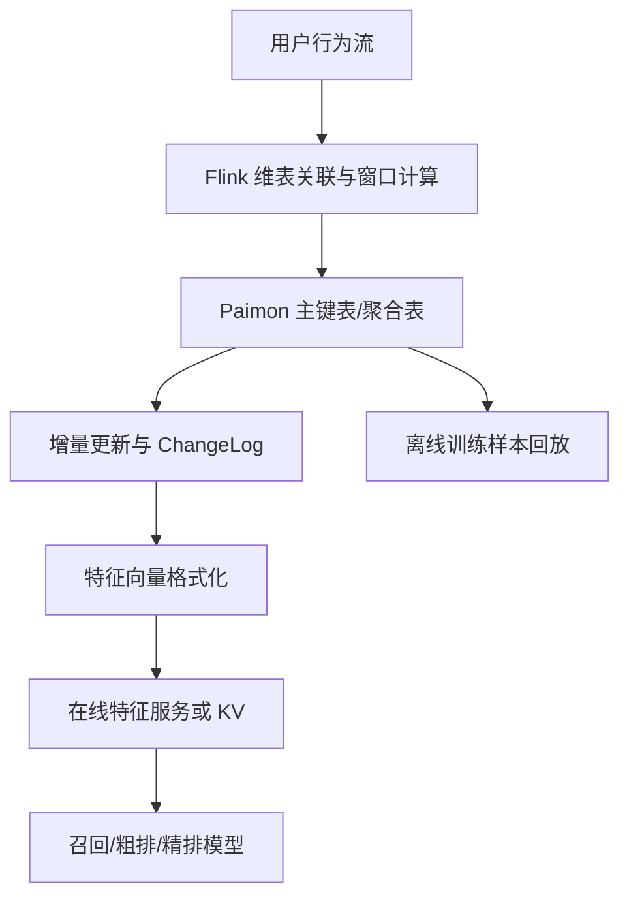

# 实时推荐长周期特征计算与状态下沉

## 来源

- [实时推荐特征工程：基于Paimon的长周期特征计算](../文章/done-实时推荐特征工程：基于Paimon的长周期特征计算.md)

## 核心问题

推荐系统既需要亚秒级感知用户短期兴趣，又需要保留 7 天、30 天、最近 200 次行为等长周期特征。核心矛盾是在线决策低延迟和长周期状态维护成本之间的冲突。

## 判断准则

| 问题 | 判断准则 |
|---|---|
| 短周期特征 | 1 分钟窗口太敏感，10 分钟可能滞后；5 分钟这类窗口要在实时性和稳定性之间取平衡 |
| 长序列特征 | 序列长度要受模型输入长度、存储成本、查询延迟和历史行为衰减共同约束 |
| 状态管理 | 长窗口用户行为明细不宜全部放在 Flink State 中，状态膨胀会带来 Checkpoint 超时和 GC 风险 |
| 状态下沉 | 用 Paimon 主键表/聚合表把大状态下沉到存储层，Flink 只维护轻量索引或增量缓冲 |
| 更新语义 | 点赞取消、行为修正等需要 ChangeLog/Upsert/Delete 语义，避免应用层手写 Retract 逻辑 |
| 在线服务 | 如果直接点查 Paimon，要验证毫秒级查询、并发、索引、缓存和推荐服务 SLA；否则仍需同步到特征 KV |
| 训练/推理一致性 | 湖仓一体特征链路的价值在于减少离线训练和在线推理口径分叉 |

## 认知偏差

| 常见错误认知 | 正确理解 |
|---|---|
| 实时特征都应该放在流计算状态里 | 长周期状态会压垮流作业，适合下沉到可更新存储层 |
| 长序列越长越好 | 历史越长成本越高，远期行为对当前推荐的贡献会衰减 |
| Paimon 可以直接替代特征平台 | Paimon 解决状态和存储更新，不自动解决在线 SLA、特征注册、权限、监控和回滚 |
| 窗口长度只看模型效果 | 窗口长度还要看噪声、推荐抖动、计算成本和业务语义 |
| 统一存储就能保证一致性 | 仍要校验特征定义、时间语义、迟到数据、回溯修正和线上读取版本 |

## 链路图

## 待验证缺口

- 需要用官方文档或真实压测补证 Paimon 点查延迟、Bucket 索引、并发读写和特征服务 SLA。
- 需要补迟到数据、行为撤回、特征回溯对训练样本和线上推理一致性的处理方案。
