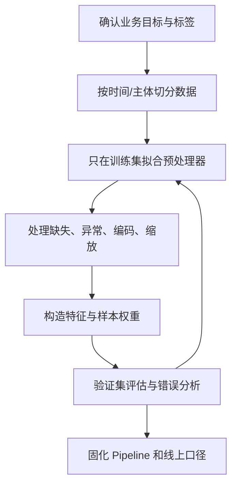

# 数据预处理流程与泄漏控制

## 来源

- [最强总结，数据预处理方法大全（代码+图文）](../文章/done-最强总结，数据预处理方法大全（代码+图文）.md)

## 核心问题

数据预处理不是一组固定函数调用，而是把原始数据变成可训练、可复现、可上线特征的流程。真正要控制的是数据质量、训练/验证边界、特征一致性和业务可解释性。

## 判断准则

| 流程节点 | 要判断的问题 | 可复用准则 |
|---|---|---|
| 数据理解 | 字段、标签、时间、粒度是否清楚 | 先确认样本粒度和标签含义，再做清洗；否则后续特征可能服务错目标 |
| 缺失值处理 | 缺失是随机、条件相关还是业务事件 | 均值/中位数填充只适合低风险数值字段；有业务含义的缺失要保留缺失标记 |
| 异常值处理 | 异常是错误还是长尾真实事件 | 不能只按 Z-Score/IQR 删除；业务真实极端值可能是模型最需要学习的信号 |
| 编码与缩放 | 模型是否依赖尺度或类别顺序 | 线性模型、距离模型优先标准化；树模型通常不依赖缩放；标签编码会给无序类别引入伪顺序 |
| 目标编码 | 是否使用了目标统计量 | 目标编码必须只在训练折内拟合，再应用到验证/测试集，避免标签泄漏 |
| 时序特征 | 是否用了未来信息 | 时间序列只能使用预测时点之前可见的数据；窗口、滞后、聚合都要按时间切分 |
| 不平衡样本 | 业务目标是否关心少数类 | SMOTE/过采样只能在训练集内做；验证集和测试集要保持真实分布 |
| 流水线 | 预处理能否复现 | 用 `Pipeline`/`ColumnTransformer` 固化训练期变换，避免训练和线上手工口径分叉 |

## 认知偏差

| 常见错误认知 | 正确理解 |
|---|---|
| 预处理越全越好 | 预处理要服务模型和业务目标，过度清洗会删除真实信号 |
| 所有缺失值都要填 | 缺失本身可能是重要特征，应先判断缺失机制 |
| 先全量清洗再切训练测试 | 任何使用全量统计量的变换都可能泄漏测试集信息 |
| 类别不平衡只要 SMOTE | 先看业务损失和阈值策略，再决定重采样、类别权重或指标切换 |
| 自动化预处理可以替代理解数据 | 自动化只能稳定执行，不能替代标签、粒度、时间边界判断 |

## 流程图

## 待验证缺口

- 需要补一篇训练/线上特征一致性的生产案例，尤其是实时特征和离线训练特征口径不一致的排障链路。
- 需要补目标编码、时间窗口、聚合特征导致泄漏的最小复现实验。
