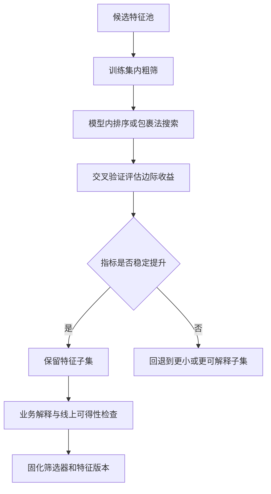

# 特征选择方法与验证边界

## 来源

- [十大数据预处理技巧：5. 特征选择](../文章/done-十大数据预处理技巧：5. 特征选择.md)
- [期刊配图：如何用皮尔逊相关系数优化特征选择？可视化新方法来了！](../文章/done-期刊配图：如何用皮尔逊相关系数优化特征选择？可视化新方法来了！.md)
- [期刊配图：结合lightgbm回归模型与K折交叉验证的特征筛选可视化](../文章/done-期刊配图：结合lightgbm回归模型与K折交叉验证的特征筛选可视化.md)

## 核心问题

特征选择的目标不是盲目减少字段，而是在成本、泛化、解释性和业务信号之间找到稳定的特征子集。选择结果必须由训练集内流程产生，并用验证集或交叉验证证明，而不是只看一次相关性或模型重要性图。

## 判断准则

| 方法 | 适合场景 | 主要风险 | 使用边界 |
|---|---|---|---|
| 过滤法 | 高维特征粗筛、快速剔除明显无关或高度冗余特征 | 只看单特征，可能漏掉组合信号 | 适合作为第一轮降维，不适合直接定最终特征集 |
| 相关系数可视化 | 排查线性冗余、多重共线性 | 只能看线性关系，不能证明预测贡献 | 高相关阈值可作为审查信号，但剔除谁要结合业务含义和验证指标 |
| 包裹法/RFE | 特征数量中等、模型已经大致确定 | 计算成本高，容易对验证集过拟合 | 必须嵌入交叉验证，不能在测试集上反复挑特征 |
| 嵌入法/Lasso/树重要性 | 希望训练和筛选同时完成 | 重要性受模型偏好和特征尺度影响 | 适合生成候选排序，仍要用独立验证确认收益 |
| 逐步添加 + K 折验证 | 需要判断前 N 个特征的边际收益 | 单次切分结论不稳 | 观察指标平台期和置信区间，比单点 R2/AUC 更可信 |

## 认知偏差

| 常见错误认知 | 正确理解 |
|---|---|
| 特征越少越好 | 特征选择追求最小充分集，不是越少越好；弱特征可能提升鲁棒性 |
| 皮尔逊相关高就一定删 | 高相关说明冗余风险，不说明哪个特征应该删；要看业务可解释性和验证收益 |
| LightGBM 重要性就是最终答案 | 树模型重要性可能偏向高基数或易分裂特征，需要用交叉验证和 SHAP/置换重要性复核 |
| 训练集和测试集分别筛选 | 必须用训练集拟合筛选器，再应用到验证/测试集；分别筛选会引入数据泄漏 |
| 可视化越漂亮越可信 | 可视化只是审查界面，不能替代数据切分、指标和稳定性验证 |

## 特征选择闭环

## 待验证缺口

- 需要补充置换重要性、SHAP 重要性和模型内置重要性的冲突处理案例。
- 需要补充大宽表场景下特征选择与特征平台版本管理的上线链路。
