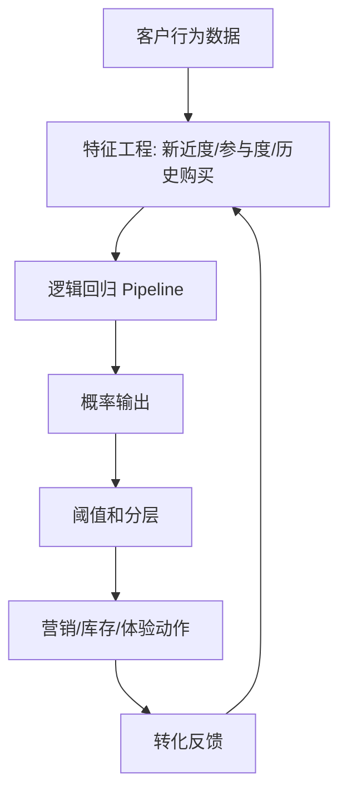

# 逻辑回归可解释基线与服务化边界

## 来源

- [解码客户行为：利用逻辑回归与FastAPI构建购买预测系统](../文章/done-解码客户行为：利用逻辑回归与FastAPI构建购买预测系统.md)

## 核心问题

逻辑回归适合做二分类业务预测的可解释基线，尤其是购买意向、流失、转化等概率输出场景。它的价值不只是简单，而是能把特征、概率、阈值和业务动作连接起来。

## 判断准则

| 环节 | 准则 |
|---|---|
| 问题定义 | 目标必须能稳定定义为二分类标签，例如购买/不购买、流失/未流失 |
| 特征工程 | 行为特征要围绕新近度、频率、强度、历史购买和上下文构造，避免只堆原始字段 |
| 训练管道 | 标准化和模型训练应放进 `Pipeline`，避免训练/测试预处理口径不一致 |
| 评估 | 至少看混淆矩阵、Precision/Recall/F1、ROC-AUC，并根据业务损失设阈值 |
| 解释 | 系数和 Odds Ratio 可用于说明方向和强度，但不能直接当因果影响 |
| 服务化 | FastAPI/Pydantic 只解决接口和数据校验，不解决模型版本、漂移、回滚和监控 |

## 认知偏差

| 常见错误认知 | 正确理解 |
|---|---|
| 逻辑回归太简单，没必要做基线 | 简单可解释模型能暴露标签、特征和指标是否成立，是复杂模型前的必要基线 |
| 概率输出可以直接营销触达 | 概率要按阈值、预算、触达成本和用户体验分层使用 |
| 系数就是因果 | 系数说明在当前模型和特征集合下的相关方向，不证明因果 |
| FastAPI 部署后就是 MLOps | 服务化只是上线形态之一，还缺模型注册、监控、漂移检测和回滚 |

## 从预测到动作

## 待验证缺口

- 需要补充阈值如何根据营销预算、触达成本和用户疲劳度设定。
- 需要补逻辑回归基线与树模型/排序模型在购买预测中的对比案例。
