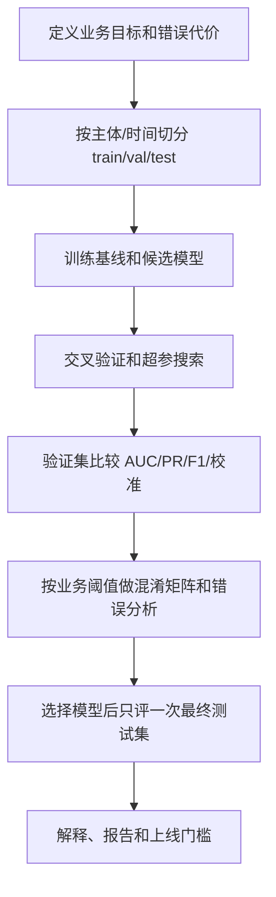

# 分类模型评估指标与阈值校准

## 来源

- [面试官问ROC曲线？这篇文章帮你轻松应对](../文章/done-面试官问ROC曲线？这篇文章帮你轻松应对.md)
- [机器学习——13种机器学习模型+贝叶斯优化超参数+ROC曲线+校准曲线+LightGBM的SHAP高级解释](../文章/done-机器学习——13种机器学习模型+贝叶斯优化超参数+ROC曲线+校准曲线+LightGBM的SHAP高级解释.md)

## 核心问题

分类模型评估不能只看一个 AUC 或准确率。离线评估要同时回答区分能力、阈值决策、概率可信度、错误代价和最终测试集泛化。

## 判断准则

| 评估问题 | 指标/方法 | 使用边界 |
|---|---|---|
| 能否区分正负样本 | ROC-AUC、PR-AUC | AUC 看排序能力，不直接给业务阈值；正样本极少时要补 PR-AUC |
| 阈值下错在哪里 | 混淆矩阵、Precision、Recall、Specificity、F1 | 阈值必须服务业务损失，不应只用 0.5 |
| 正负样本是否不平衡 | ROC、PR、类别分布 | ROC 对类比例相对不敏感，但业务成本仍会受样本比例影响 |
| 概率是否可信 | 校准曲线、Brier Score、CalibratedClassifierCV | AUC 高不代表概率可直接用于风险定价、排序分层或库存决策 |
| 模型是否泛化 | train/val/test 切分、交叉验证、最终测试集 | 调参只看验证集，最终测试集只能在模型选择后使用 |
| 模型是否可解释 | SHAP、特征重要性、错误分层 | 解释帮助定位错误，不等于因果结论 |

## 认知偏差

| 常见错误认知 | 正确理解 |
|---|---|
| AUC 高就是模型好 | AUC 只说明排序能力；还要看业务阈值、校准和错误代价 |
| ROC 不受样本不平衡影响，所以足够 | ROC 坐标按正负类内部比例计算，但业务收益和告警量仍受真实分布影响 |
| 贝叶斯优化一定优于人工调参 | 贝叶斯优化只是搜索策略，搜索空间、交叉验证和泄漏控制更关键 |
| 校准曲线只是可视化 | 当输出概率参与业务决策时，校准是上线门槛 |
| 最优模型只按验证集 AUC 选 | 需要同时看稳定性、解释性、部署成本和最终测试集表现 |

## 评估流程

## 待验证缺口

- 需要补充 PR-AUC、Lift、KS、Decile 在业务风控、推荐和营销场景中的使用边界。
- 需要补一篇离线指标与线上收益不一致的案例，形成错误分析和回滚准则。
