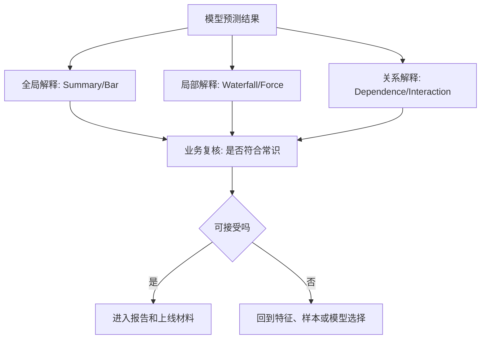

# SHAP解释图谱与因果边界

## 来源

- [机器学习——13种机器学习模型+贝叶斯优化超参数+ROC曲线+校准曲线+LightGBM的SHAP高级解释](../../0603_模型评估/文章/done-机器学习——13种机器学习模型+贝叶斯优化超参数+ROC曲线+校准曲线+LightGBM的SHAP高级解释.md)

## 核心问题

SHAP 能把模型输出拆到特征贡献，但它解释的是“模型如何使用特征”，不是“现实世界中这个特征导致了结果”。可解释性产物要区分全局重要性、局部解释、交互关系和业务可接受性。

## 判断准则

| 图/方法 | 回答的问题 | 使用边界 |
|---|---|---|
| Summary/Bar | 全局哪些特征平均影响最大 | 只说明平均模型贡献，不说明个体原因 |
| Beeswarm | 特征值大小如何影响预测方向 | 可观察非线性和方向，但仍受特征相关性影响 |
| Waterfall/Force | 单个样本为什么被这样预测 | 适合个案复核，不适合直接推广成规则 |
| Dependence | 某特征在不同取值下如何影响输出 | 可找阈值/非线性，但阈值需要业务和验证集复核 |
| Interaction | 两个特征是否存在额外组合效应 | 计算成本高，且高相关特征会让解释不稳定 |
| 内置重要性对比 SHAP | 模型结构重要性和输出贡献是否一致 | 两者冲突时优先回到验证指标、业务含义和稳定性 |

## 认知偏差

| 常见错误认知 | 正确理解 |
|---|---|
| SHAP 值大说明这个特征是因果原因 | SHAP 是模型贡献，不是因果推断 |
| 全局重要性足够解释所有用户 | 个体解释可能和全局排序不同 |
| 解释图越复杂越专业 | 解释图要服务复核和行动，过多图表会掩盖关键判断 |
| SHAP 可以替代模型评估 | 解释只能说明模型使用了什么，不能证明模型预测对 |
| 特征重要性稳定 | 特征相关、样本切分、模型版本变化都会改变解释 |

## 解释产物分层

## 待验证缺口

- 需要补充 SHAP 在强相关特征、目标编码特征、时间窗口特征上的解释稳定性案例。
- 需要补一篇业务方如何审阅解释性报告的实践文章。
