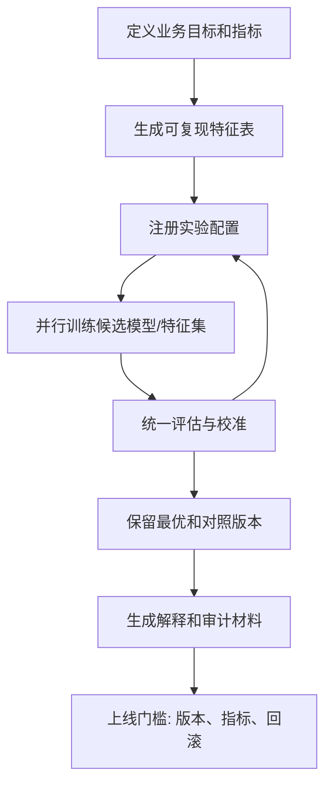

# 机器学习实验自动化与审计链路

## 来源

- [传统机器学习在大模型时代的崛起和普及](../文章/done-传统机器学习在大模型时代的崛起和普及.md)
- [科研人的外挂：用Python自动化和并行，让模型自己跑起来！](../文章/done-科研人的外挂：用Python自动化和并行，让模型自己跑起来！.md)

## 核心问题

机器学习实验适合自动化，因为它有明确输入、候选特征、模型配置、指标和可复核产物。但自动化的价值不只是“跑得快”，而是形成可复现、可比较、可解释、可审计的实验链路。

## 判断准则

| 环节 | 自动化对象 | 判断准则 |
|---|---|---|
| 数据准备 | 数据加载、跨源取数、特征表生成 | 特征逻辑要可执行、可复用、可审计，不能只留在 notebook 临时变量里 |
| 实验并行 | 多模型、多特征集、多参数搜索 | 只有目标指标清楚时才适合并行搜索，否则会放大噪声 |
| 工作流编排 | Snakemake/Luigi/Dask/Joblib/Agent Teams | 任务依赖、输入输出和重跑边界要明确，避免“跑了很多但不可复现” |
| 指标比较 | AUC、KS、Gini、IV、PSI、Decile 等 | 指标要和业务目标绑定，不能只按单点 AUC 选模型 |
| 可解释交付 | WOE、IV、分箱、特征贡献、实验历史 | 对风控、运营、库存等场景，审计材料和模型文件同等重要 |
| 上线前门槛 | 最优版本、模型路径、特征版本、报告 | 没有版本和证据链的自动实验不能进入生产 |

## 认知偏差

| 常见错误认知 | 正确理解 |
|---|---|
| Agent/脚本能自动跑实验，所以建模门槛消失 | 自动化降低执行成本，但问题定义、标签、指标和审计仍需人负责 |
| 实验次数越多越好 | 没有假设管理和验证集纪律，实验越多越容易过拟合验证集 |
| 并行只是加速工具 | 并行会改变实验管理要求：必须记录配置、随机种子、输入数据和产物 |
| 黑盒模型 AUC 高就应上线 | 在风控等场景，评分卡或可解释模型可能以略低 AUC 换取合规、审计和业务可接受性 |
| notebook 结果等于可交付 | 可交付要包含数据管道、模型版本、指标、解释、报告和复现命令 |

## 实验自动化流程

## 待验证缺口

- 需要补 MLflow、模型注册、特征版本和回滚的生产案例。
- 需要补自动化实验如何防止验证集过拟合的制度化做法。
