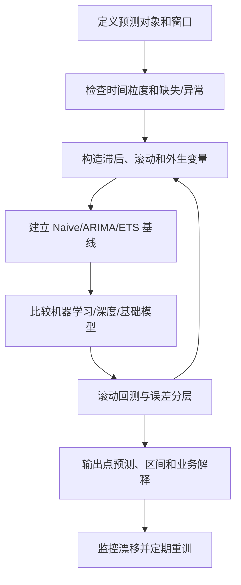

# 时序预测建模与验证边界

## 来源

- [darts，全能的预测专家！](../文章/done-darts，全能的预测专家！.md)
- [TimeCopilot 开源发布：用“AI 代理”把时序预测从专家工具变成对话式服务](../文章/done-TimeCopilot 开源发布：用“AI 代理”把时序预测从专家工具变成对话式服务.md)
- [数据挖掘实战-基于LSTM时间序列模型的香烟销售预测分析](../文章/done-数据挖掘实战-基于LSTM时间序列模型的香烟销售预测分析.md)

## 核心问题

时序预测不是“选一个模型预测未来”。它首先要确认时间粒度、预测窗口、可见特征、回测方式和业务使用方式，再决定使用统计模型、机器学习模型、深度模型、基础模型或自动化编排工具。

## 判断准则

| 判断项 | 准则 |
|---|---|
| 时间切分 | 训练、验证、测试必须按时间顺序切分，不能随机打散 |
| 窗口构造 | 滞后特征、滚动统计和协变量只能使用预测时点之前可见的数据 |
| 模型选择 | 简单季节性和趋势先用 Naive/ARIMA/ETS 做基线，再比较 LSTM、GBDT、Darts 模型或 TSFM |
| 协变量 | 促销、节假日、天气、价格等外生变量只有在预测时可获得或可模拟时才可用 |
| 回测 | 用 rolling backtest 或时间交叉验证评估多个预测窗口，避免单次切分偶然性 |
| 指标 | MAPE/MAE/RMSE/CRPS 要和业务损失匹配；低销量品类要小心 MAPE 失真 |
| 工具链 | Darts 价值在统一 API 和模型比较；Agent 编排价值在自动分析、模型选择和解释，但仍要验证数据与指标 |
| 业务落地 | 库存、采购、排班、预算使用预测时，要给置信区间和错误代价，不只给点预测 |

## 认知偏差

| 常见错误认知 | 正确理解 |
|---|---|
| LSTM 比传统模型天然更好 | 数据短、噪声大、外生变量缺失时，LSTM 可能只拟合趋势，精度不稳定 |
| 趋势吻合就是预测好 | 趋势像不代表可用于库存或采购决策；还要看误差、置信区间和业务损失 |
| 工具统一 API 就解决预测问题 | API 统一降低实验成本，但数据粒度、泄漏和回测设计仍是核心 |
| Agent 可以替代预测专家 | Agent 适合编排模型、解释指标和降低使用门槛，但不能替代业务约束和评估纪律 |
| 只要历史序列就够 | 很多业务预测依赖促销、节假日、价格、渠道和库存等外生变量 |

## 时序预测流程

## 待验证缺口

- 需要补一篇真实零售/供应链预测中的促销、节假日和库存缺货处理案例。
- 需要补概率预测和预测区间如何进入库存安全水位或采购策略的实践材料。
