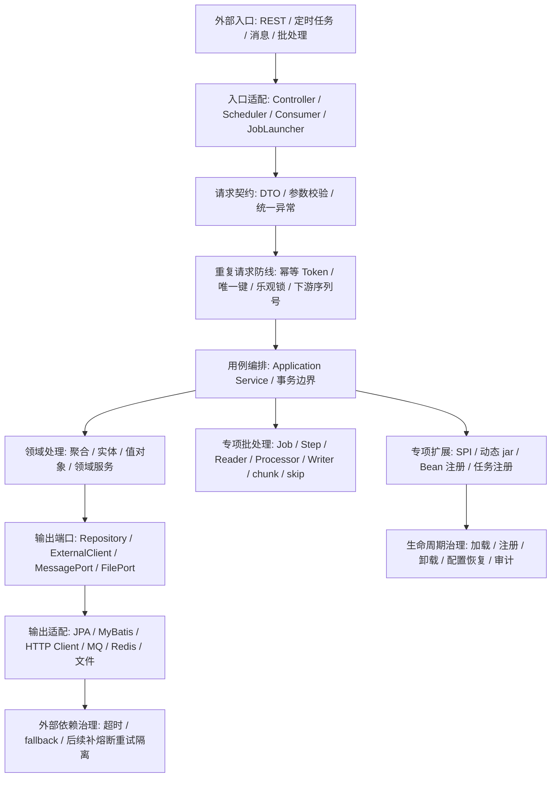

# Java 作为后端服务的完整流程

## 目标

这个知识点回答：

> Java 服务从接收请求到完成业务写入、调用外部依赖、处理批任务或扩展能力，完整流程应该怎么设计和书写。

这里不再只列文章名称，而是把收藏文章中的有效内容吸收到服务流程里。

## 总体流程



## 1. 外部入口先分类

Java 服务不是只有 Controller。

| 入口类型 | 代码位置 | 典型场景 | 后续流向 |
|---|---|---|---|
| REST API | `interfaces/rest` 或 `web/controller` | 前端、开放接口、内部 HTTP 调用 | DTO 校验 -> Application Service |
| 定时任务 | `interfaces/scheduler` | 定时补偿、巡检、同步 | Scheduler -> Application Service 或 JobLauncher |
| 消息消费 | `interfaces/messaging` | 异步事件、订单状态、通知 | Consumer -> Application Service |
| 批处理作业 | `batch` 或 `interfaces/job` | 导入、对账、迁移、日终任务 | JobLauncher -> Job -> Step |
| 插件扩展 | `infrastructure/plugin` 或 `extension` | 动态任务、规则包、能力扩展 | 扩展点 -> 加载注册 -> Application Service |

吸收自文章：

- 六边形架构文章提醒：REST、数据库、第三方服务都只是适配器，业务核心不应该依赖它们。
- Spring Batch 文章提醒：批处理入口不要伪装成普通 Controller，应该进入 Job/Step 作业模型。

## 2. Controller 只做入口适配

Controller 的职责是接收外部请求、触发参数校验、转换命令、调用用例、转换响应。

```java
@RestController
@RequestMapping("/orders")
public class OrderController {
    private final CreateOrderUseCase createOrderUseCase;

    @PostMapping
    public OrderResponse create(@Valid @RequestBody CreateOrderRequest request) {
        CreateOrderCommand command = request.toCommand();
        OrderResult result = createOrderUseCase.create(command);
        return OrderResponse.from(result);
    }
}
```

| 该做 | 不该做 |
|---|---|
| 接收 DTO | 不写业务规则 |
| 调用 `@Valid` / `@Validated` 校验 | 不直接访问 Repository |
| DTO 转 Command | 不把外部请求对象传入领域层 |
| 调用 UseCase / Application Service | 不处理复杂事务 |
| Response 转换 | 不直接暴露领域对象 |

吸收自文章：

- 参数校验文章补充了 `@Valid`、`@Validated`、嵌套校验和全局异常处理。
- 六边形架构文章补充了“输入适配器”概念，Controller 是输入适配器，不是业务核心。

## 3. 参数校验是入口契约，不是业务规则

参数校验解决的是“请求形态是否合法”，不是“业务状态是否允许”。

| 校验对象 | 推荐方式 | 放置位置 |
|---|---|---|
| 请求体字段 | DTO 字段上加 Bean Validation 注解 | `interfaces/rest/dto` |
| 嵌套对象 | 嵌套字段上显式加 `@Valid` | DTO 内部 |
| 平铺参数 | Controller 类或方法使用 `@Validated` | Controller |
| 分组校验 | `@Validated(Group.class)` | Controller / DTO |
| 校验失败响应 | 全局异常处理 | `interfaces/rest/advice` |

```java
public class CreateOrderRequest {
    @NotNull
    private Long userId;

    @Valid
    @NotEmpty
    private List<CreateOrderItemRequest> items;
}
```

处理准则：

| 准则 | 原因 |
|---|---|
| DTO 负责入口形态校验 | 避免业务层堆满空值、长度、格式判断 |
| 领域对象负责业务不变量 | 例如订单状态、库存规则、额度限制 |
| 全局异常统一返回 | 避免校验异常直接暴露框架默认长错误 |

## 4. 写操作必须先判断幂等

不是所有接口都需要幂等，但所有会产生副作用、可能被重复触发的写操作都要判断。

| 写操作类型 | 优先方案 | 文章中的机制 | 注意点 |
|---|---|---|---|
| 插入类操作 | 数据库唯一键 | 业务唯一主键 / 分布式 ID | 不要只依赖自增主键 |
| 更新类操作 | 乐观锁 | `version` 字段作为更新条件 | 只保护带版本条件的更新 |
| 前端重复提交 | 防重 Token | Token 存 Redis，请求携带 Header | 查找和删除必须原子化，文章用 Lua |
| 上下游调用 | 下游唯一序列号 | 下游生成请求序列号，上游去重 | 需要调用方稳定传递序列号 |

流程位置：

```text
Controller 参数校验通过
  -> 判断是否写操作
  -> 判断是否可能重复提交、超时重试、并发更新
  -> 选择幂等策略
  -> 再进入 Application Service
```

吸收自幂等文章：

- 文章给出的四种方案要吸收为“按副作用选择”，不是背方案。
- Token 方案是其中一种，不是默认答案。

## 5. Application Service 负责用例和事务

Application Service 是一次业务动作的编排点。

```java
@Service
public class CreateOrderService implements CreateOrderUseCase {
    private final OrderRepository orderRepository;
    private final PaymentPort paymentPort;

    @Transactional
    public OrderResult create(CreateOrderCommand command) {
        Order order = Order.create(command.userId(), command.items());
        orderRepository.save(order);
        paymentPort.prepare(order.paymentRequest());
        return OrderResult.from(order);
    }
}
```

| 该做 | 不该做 |
|---|---|
| 开启事务 | 不接收 HTTP Request |
| 编排领域对象 | 不写 SQL 和 HTTP 调用细节 |
| 调用输出端口 | 不直接依赖第三方 SDK |
| 返回用例结果 | 不返回数据库 Entity |

吸收自六边形架构文章：

- 输入端口表示用例入口。
- 输出端口表示业务需要的外部能力。
- 适配器实现技术细节。

## 6. 领域层表达业务核心

领域层应该表达业务概念、状态和不变量。

```java
public class Order {
    private OrderId id;
    private OrderStatus status;
    private List<OrderItem> items;

    public static Order create(UserId userId, List<OrderItem> items) {
        if (items.isEmpty()) {
            throw new DomainException("订单明细不能为空");
        }
        return new Order(new OrderId(), OrderStatus.CREATED, items);
    }

    public void cancel() {
        if (!status.canCancel()) {
            throw new DomainException("当前状态不能取消订单");
        }
        this.status = OrderStatus.CANCELED;
    }
}
```

| 对象 | 职责 |
|---|---|
| Entity | 有身份和生命周期的业务对象 |
| Value Object | 无身份、不可变、表达业务约束的值 |
| Aggregate | 一致性边界 |
| Domain Service | 不自然属于某个实体的领域规则 |
| Repository 接口 | 领域对象持久化能力的抽象 |

吸收自六边形和 DDD 文章内容：

- DDD + 六边形适合复杂业务，不适合所有项目。
- 简单项目可以用 `web/service/repository/integration`，但核心业务应隔离领域和外部技术。

## 7. 输出端口隔离外部依赖

外部系统不能直接进入业务核心。

| 外部依赖 | 端口 | 适配器 |
|---|---|---|
| 数据库 | `OrderRepository` | JPA / MyBatis 实现 |
| 第三方支付 | `PaymentPort` | HTTP Client / SDK 实现 |
| 消息队列 | `MessagePort` | Kafka / RabbitMQ / RocketMQ 实现 |
| 文件系统 | `FilePort` | OSS / 本地文件 / S3 实现 |
| 缓存 | `CachePort` | Redis 实现 |

```java
public interface PaymentPort {
    PaymentPrepareResult prepare(PaymentRequest request);
}
```

## 8. 外部依赖必须有时间边界

调用第三方接口、远程服务、慢查询、文件处理时，不能无限等待。

| 机制 | 作用 | 当前文章覆盖度 |
|---|---|---|
| 客户端超时 | 限制连接、读取、整体请求时间 | 需要补具体 HTTP Client 资料 |
| `TimeLimiter` | 限制异步调用时间 | Resilience4j 文章覆盖 |
| fallback | 超时或失败后的降级结果 | Resilience4j 文章覆盖 |
| CircuitBreaker | 熔断失败依赖 | 当前缺 |
| Retry | 控制重试次数和间隔 | 当前缺 |
| Bulkhead | 隔离线程池或并发资源 | 当前缺 |

吸收自 Resilience4j 文章：

```text
application.yml 配 timeoutDuration
  -> 方法返回 CompletableFuture
  -> @TimeLimiter 指定 fallbackMethod
  -> 超时后走 fallback
```

处理建议：

- 这篇文章只能补“时间边界”。
- 不能把它当成完整稳定性治理方案。

## 9. 批处理走 Job/Step，不要写成普通循环

当需求是导入、迁移、对账、日终任务、批量修复时，优先判断是否需要 Spring Batch 模型。

| 概念 | 作用 |
|---|---|
| Job | 一个完整批处理作业 |
| Step | 作业中的一个阶段 |
| JobParameters | 标识一次逻辑作业实例 |
| JobInstance | Job + 参数形成的逻辑实例 |
| JobExecution | 某次运行尝试 |
| StepExecution | 某个 Step 的运行记录 |
| JobRepository | 持久化作业元数据 |
| JobLauncher | 启动作业 |
| ItemReader | 读取数据 |
| ItemProcessor | 处理数据 |
| ItemWriter | 写出数据 |
| chunk | 分块提交事务 |
| skip / noSkip | 可跳过异常和不可跳过异常 |

流程：

```text
Scheduler / API / 命令行触发
  -> JobLauncher.run(Job, JobParameters)
  -> JobRepository 创建或读取 JobExecution
  -> Step 执行
  -> ItemReader 逐条读
  -> ItemProcessor 处理
  -> 按 chunk 交给 ItemWriter
  -> StepExecution / JobExecution 记录状态
```

吸收自 Spring Batch 文章：

- 批处理核心不是“定时跑”，而是可记录、可重启、可分块提交、可跳过部分错误。
- 调度器只负责什么时候跑，Batch 负责怎么可靠地跑。

## 10. 扩展能力先定义扩展点，再谈动态加载

插件化要分两层看：

| 层次 | 机制 | 适用 |
|---|---|---|
| 扩展点发现 | Java SPI / Spring factories / 自定义注册表 | 主系统定义接口，实现方按约定注册 |
| 运行时装载 | URLClassLoader / 动态注册 Bean / 动态注册任务 | 平台型系统、动态规则、动态任务 |

SPI 的吸收点：

```text
调用方定义接口
  -> 实现方在 META-INF/services/<接口全限定名> 声明实现类
  -> ServiceLoader 读取配置
  -> 反射加载实现
```

动态 jar 的吸收点：

| 状态 | 加载时 | 卸载时 | 风险 |
|---|---|---|---|
| ClassLoader | URLClassLoader 加载 jar | close 并清理引用 | 类、线程、静态变量可能残留 |
| Spring 容器 | 注册 BeanDefinition | destroyBean、移除 BeanDefinition | 依赖 Spring 内部结构 |
| 任务执行器 | 注册 xxl-job handler | 移除 handler | 反射私有字段，兼容性风险 |
| 配置中心 | 记录已加载 jar | 更新配置状态 | 配置和内存状态可能不一致 |

处理建议：

- 普通业务系统不要默认使用动态 jar。
- 需要插件化时，先设计扩展点接口、生命周期、隔离、审计和回滚。

## 文章内容真正进入了哪些流程节点

| 文章 | 进入的流程节点 | 形成的准则 |
|---|---|---|
| SpringBoot 的 3 种六边形架构应用方式 | 入口适配、应用服务、领域层、输出端口、适配器 | 业务核心隔离外部技术，按复杂度选择轻量分层/经典六边形/DDD + 六边形 |
| 参数校验文章 | 请求契约 | DTO 做形态校验，嵌套对象显式 `@Valid`，异常统一处理 |
| 幂等文章 | 重复请求防线 | 写操作按副作用选择唯一键、乐观锁、Token、下游序列号 |
| Resilience4j 文章 | 外部依赖治理 | 外部调用必须有时间边界和 fallback，但还缺完整熔断重试隔离 |
| Spring Batch 文章 | 专项批处理 | 批处理进入 Job/Step/chunk/skip/JobRepository 模型 |
| 动态 jar 文章 | 专项扩展 | 动态加载必须管理 ClassLoader、Bean、任务、配置四套状态 |
| Java SPI 文章 | 专项扩展 | 扩展能力先定义接口和发现机制，再考虑动态加载 |

## 当前仍缺的流程节点

| 流程节点 | 缺口 |
|---|---|
| 认证授权 | 缺 Spring Security / OAuth2 / RBAC |
| 测试质量 | 缺单元测试、集成测试、契约测试、架构规则测试 |
| 可观测性 | 缺日志、指标、链路追踪、告警 |
| 部署发布 | 缺配置、环境、健康检查、回滚 |
| 完整韧性治理 | 缺 CircuitBreaker、Retry、Bulkhead、RateLimiter |
