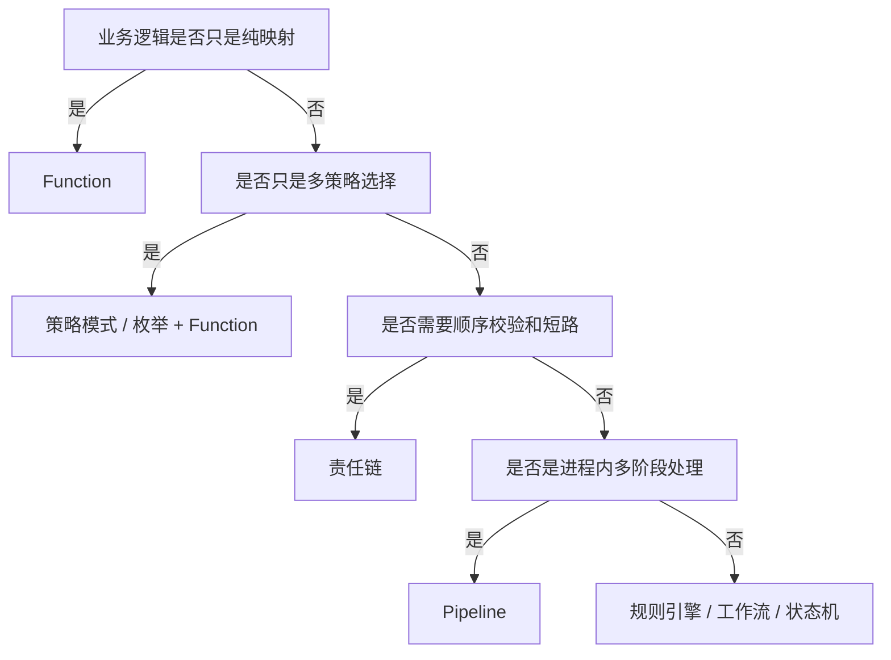

# Java 函数式接口与业务编排边界

## 来源

- [Function + 异常策略链](../文章/done-Function + 异常策略链：从“用函数”到“打造函数基础设施”.md)
- [Java Function 高阶用法](../文章/done-Java Function高阶用法：优化代码质量的10个实战技巧.md)
- [一些 Function 的最佳使用场景与避坑点](../文章/done-一些 Function 的最佳使用场景与避坑点.md)
- [分享 Java Function 的 10 个高阶用法](../文章/done-分享 Java Function 的 10 个高阶用法！.md)
- [分享 Function 封装的 12 个常用工具类](../文章/done-分享 Function 封装的 12 个常用工具类！.md)
- [分享 Function、Consumer、Supplier 使用技巧](../文章/done-分享一些 Function_T, R_、Consumer_T_、Supplier_T_ 巧妙使用技巧！.md)
- [京东后端 Pipeline 设计](../文章/done-京东后端架构技术，Pipline 设计 解决复杂查询逻辑.md)
- [责任链实战的高级用法](../文章/done-责任链实战的高级用法：多级校验、工作流，这样写代码才足够优雅.md)

## 核心问题

这些文章反复讲 Function、Consumer、Supplier、Pipeline 和责任链。真正值得沉淀的不是语法技巧，而是：什么时候可以用函数式接口表达可组合步骤，什么时候应该升级为策略、责任链、Pipeline、规则引擎或工作流。

## 判断准则

| 场景 | 可用方式 | 边界 |
|---|---|---|
| 单次输入映射、字段提取、格式转换 | `Function<T, R>` | 只表达纯转换，不夹带数据库写入、远程调用等副作用 |
| 可替换算法、轻量策略选择 | 枚举 + Function / 策略 Map | 需要明确默认策略、异常策略和测试样例 |
| 多步骤校验、可短路流程 | 责任链 | 每个节点必须有输入、输出、失败原因和是否继续的契约 |
| 多阶段业务编排 | Pipeline | 要定义上下文对象、节点顺序、错误处理、观测点和回滚边界 |
| 规则频繁调整、运营配置驱动 | 规则引擎 / 工作流 | 不要用 Function 硬拼 DSL；需要版本、审计、灰度和回滚 |

## 认知偏差

| 常见错误认知 | 正确理解 |
|---|---|
| Function 可以让所有代码更优雅 | Function 只能降低局部表达成本，不能替代模块边界和流程治理 |
| 函数式链式调用天然可维护 | 链越长越需要命名、分层、错误语义和调试信号 |
| 责任链就是 Pipeline | 责任链偏校验和短路，Pipeline 偏阶段化处理和上下文流转 |
| Pipeline 可以替代工作流 | Pipeline 适合进程内业务编排，跨人、跨系统、长事务仍需要工作流或状态机 |

## 编排选择图

## 待验证缺口

- Pipeline 节点的可观测性：每个节点是否有耗时、输入摘要、失败原因和上下文快照。
- 责任链与 Bean Validation、领域规则、审批流的边界还需要更高质量案例。
- Function 异常策略链需要验证异常分类、恢复策略、失败透传和日志字段。
